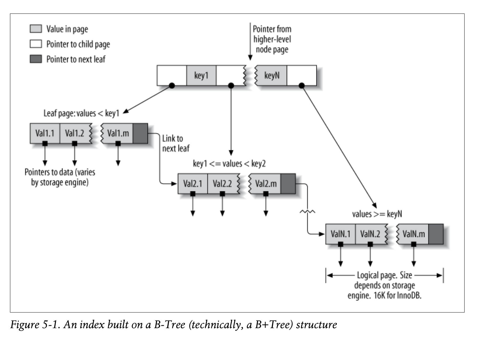
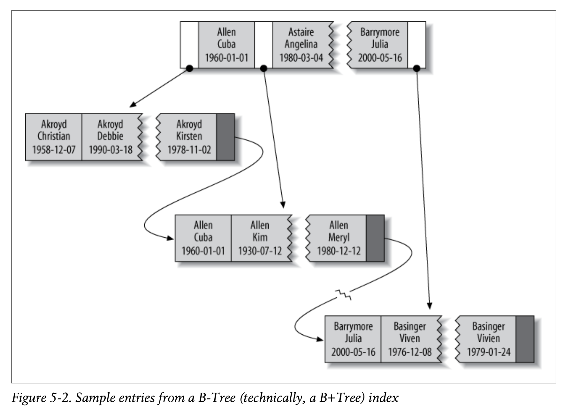

Index (hay còn gọi là "key" trong MySQL) là một cấu trúc dữ liệu(data structure) mà các storage engine dùng để
tìm kiếm các hàng(row) một cách nhanh chóng. Index có một số một vài lợi ích mà chúng tôi sẽ đề cập đến trong chương này.

Indexes are critical for good performance, and become more important as your data
grows larger. Small, lightly loaded databases often perform well even without proper
indexes, but as the dataset grows, performance can drop very quickly.^1 Unfortunately,
indexes are often forgotten or misunderstood, so poor indexing is a leading cause of
real-world performance problems. That’s why we put this material early in the bookeven 
earlier than our discussion of query optimization.

Index optimization is perhaps the most powerful way to improve query performance.
Indexes can improve performance by many orders of magnitude, and optimal indexes
can sometimes boost performance about two orders of magnitude more than indexes
that are merely “good.” Creating truly optimal indexes will often require you to rewrite
queries, so this chapter and the next one are closely related.

# Indexing Basics

The easiest way to understand how an index works in MySQL is to think about the
index in a book. To find out where a particular topic is discussed in a book, you look
in the index, and it tells you the page number(s) where that term appears.

In MySQL, a storage engine uses indexes in a similar way. It searches the index’s data
structure for a value. When it finds a match, it can find the row that contains the match.
Suppose you run the following query:

```
mysql> SELECT first_name FROM sakila.actor WHERE actor_id = 5;
```

There’s an index on the actor_id column, so MySQL will use the index to find rows
whose actor_id is 5. In other words, it performs a lookup on the values in the index
and returns any rows containing the specified value.

An index contains values from one or more columns in a table. If you index more than
one column, the column order is very important, because MySQL can only search
efficiently on a leftmost prefix of the index. Creating an index on two columns is not
the same as creating two separate single-column indexes, as you’ll see.

```
If I Use an ORM, Do I Need to Care?
The short version: yes, you still need to learn about indexing, even if you rely on an
object-relational mapping (ORM) tool.
ORMs produce logically and syntactically correct queries (most of the time), but they
rarely produce index-friendly queries, unless you use them for only the most basic types
of queries, such as primary key lookups. You can’t expect your ORM, no matter how
sophisticated, to handle the subtleties and complexities of indexing. Read the rest of
this chapter if you disagree! It’s sometimes a hard job for an expert human to puzzle
through all of the possibilities, let alone an ORM.
```
# Types of Indexes

There are many types of indexes, each designed to perform well for different purposes.
Indexes are implemented in the storage engine layer, not the server layer. Thus, they
are not standardized: indexing works slightly differently in each engine, and not all
engines support all types of indexes. Even when multiple engines support the same
index type, they might implement it differently under the hood.

That said, let’s look at the index types MySQL currently supports, their benefits, and
their drawbacks.

## B-Tree indexes

When people talk about an index without mentioning a type, they’re probably referring
to a _B-Tree index_ , which typically uses a B-Tree data structure to store its data. Most
of MySQL’s storage engines support this index type. The Archive engine is the excep-
tion: it didn’t support indexes at all until MySQL 5.1, when it started to allow a single
indexed AUTO_INCREMENT column.

We use the term “B-Tree” for these indexes because that’s what MySQL uses in CREATE
TABLE and other statements. However, storage engines might use different storage
structures internally. For example, the NDB Cluster storage engine uses a T-Tree data

structure for these indexes, even though they’re labeled BTREE, and InnoDB uses
B+Trees. The variations in the structures and algorithms are out of scope for this book,
though.

Storage engines use B-Tree indexes in various ways, which can affect performance. For
instance, MyISAM uses a prefix compression technique that makes indexes smaller,
but InnoDB leaves values uncompressed in its indexes. Also, MyISAM indexes refer to
the indexed rows by their physical storage locations, but InnoDB refers to them by their
primary key values. Each variation has benefits and drawbacks.

The general idea of a B-Tree is that all the values are stored in order, and each leaf page
is the same distance from the root. Figure 5-1 shows an abstract representation of a B-
Tree index, which corresponds roughly to how InnoDB’s indexes work. MyISAM uses
a different structure, but the principles are similar.

A B-Tree index speeds up data access because the storage engine doesn’t have to scan
the whole table to find the desired data. Instead, it starts at the root node (not shown
in this figure). The slots in the root node hold pointers to child nodes, and the storage
engine follows these pointers. It finds the right pointer by looking at the values in the
node pages, which define the upper and lower bounds of the values in the child nodes.
Eventually, the storage engine either determines that the desired value doesn’t exist or
successfully reaches a leaf page.
    



Leaf pages are special, because they have pointers to the indexed data instead of
pointers to other pages. (Different storage engines have different types of “pointers” to
the data.) Our illustration shows only one node page and its leaf pages, but there might
be many levels of node pages between the root and the leaves. The tree’s depth depends
on how big the table is.

Because B-Trees store the indexed columns in order, they’re useful for searching for
ranges of data. For instance, descending the tree for an index on a text field passes
through values in alphabetical order, so looking for “everyone whose name begins with
I through K” is efficient.

Suppose you have the following table:

```
CREATE TABLE People (
last_name varchar(50) not null,
first_name varchar(50) not null,
dob date not null,
gender enum('m', 'f')not null,
key(last_name, first_name, dob)
);
```
The index will contain the values from the last_name, first_name, and dob columns for
every row in the table. Figure 5-2 illustrates how the index arranges the data it stores.




Notice that the index sorts the values according to the order of the columns given in
the index in the CREATE TABLE statement. Look at the last two entries: there are two
people with the same name but different birth dates, and they’re sorted by birth date.

B-Tree indexes work well for lookups by the full
key value, a key range, or a key prefix. They are useful only if the lookup uses a leftmost
prefix of the index.^3 The index we showed in the previous section will be useful for the
following kinds of queries:

_Match the full value_
A match on the full key value specifies values for all columns in the index. For
example, this index can help you find a person named Cuba Allen who was born
on 1960-01-01.

_Match a leftmost prefix_
This index can help you find all people with the last name Allen. This uses only
the first column in the index.

_Match a column prefix_
You can match on the first part of a column’s value. This index can help you find
all people whose last names begin with J. This uses only the first column in the
index.

_Match a range of values_
This index can help you find people whose last names are between Allen and Bar-
rymore. This also uses only the first column.

_Match one part exactly and match a range on another part_
This index can help you find everyone whose last name is Allen and whose first
name starts with the letter K (Kim, Karl, etc.). This is an exact match on last_
name and a range query on first_name.

_Index-only queries_
B-Tree indexes can normally support index-only queries, which are queries that
access only the index, not the row storage. We discuss this optimization in “Cov-
ering Indexes” on page 177.

Because the tree’s nodes are sorted, they can be used for both lookups (finding values)
and ORDER BY queries (finding values in sorted order). In general, if a B-Tree can help
you find a row in a particular way, it can help you sort rows by the same criteria. So,
our index will be helpful for ORDER BY clauses that match all the types of lookups we
just listed.

Here are some limitations of B-Tree indexes:

**Types of queries that can use a B-Tree index.**

3. This is MySQL-specific, and even version-specific. Some other databases can use nonleading index parts,
    though it’s usually more efficient to use a complete prefix. MySQL might offer this option in the future;
    we show workarounds later in the chapter.


- They are not useful if the lookup does not start from the leftmost side of the indexed
    columns. For example, this index won’t help you find all people named Bill or all
    people born on a certain date, because those columns are not leftmost in the index.
    Likewise, you can’t use the index to find people whose last name _ends_ with a par-
    ticular letter.
- You can’t skip columns in the index. That is, you won’t be able to find all people
    whose last name is Smith and who were born on a particular date. If you don’t
    specify a value for the first_name column, MySQL can use only the first column
    of the index.
- The storage engine can’t optimize accesses with any columns to the right of the
    first range condition. For example, if your query is WHERE last_name="Smith" AND
    first_name LIKE 'J%' AND dob='1976-12-23', the index access will use only the
    first two columns in the index, because the LIKE is a range condition (the server
    can use the rest of the columns for other purposes, though). For a column that has
    a limited number of values, you can often work around this by specifying equality
    conditions instead of range conditions. We show detailed examples of this in the
    indexing case study later in this chapter.

Now you know why we said the column order is extremely important: these limitations
are all related to column ordering. For optimal performance, you might need to create
indexes with the same columns in different orders to satisfy your queries.

Some of these limitations are not inherent to B-Tree indexes, but are a result of how
the MySQL query optimizer and storage engines use indexes. Some of them might be
removed in the future.

## Hash indexes

A _hash index_ is built on a hash table and is useful only for exact lookups that use every
column in the index.^4 For each row, the storage engine computes a _hash code_ of the
indexed columns, which is a small value that will probably differ from the hash codes
computed for other rows with different key values. It stores the hash codes in the index
and stores a pointer to each row in a hash table.

In MySQL, only the Memory storage engine supports explicit hash indexes. They are
the default index type for Memory tables, though Memory tables can have B-Tree in-
dexes, too. The Memory engine supports nonunique hash indexes, which is unusual
in the database world. If multiple values have the same hash code, the index will store
their row pointers in the same hash table entry, using a linked list.

Here’s an example. Suppose we have the following table:

```
CREATE TABLE testhash (
fname VARCHAR(50) NOT NULL,
lname VARCHAR(50) NOT NULL,
```
4. See the computer science literature for more on hash tables.


```
KEY USING HASH(fname)
) ENGINE=MEMORY;
```
containing this data:

```
mysql> SELECT * FROM testhash;
+--------+-----------+
| fname | lname |
+--------+-----------+
| Arjen | Lentz |
| Baron | Schwartz |
| Peter | Zaitsev |
| Vadim | Tkachenko |
+--------+-----------+
```
Now suppose the index uses an imaginary hash function called f(), which returns the
following values (these are just examples, not real values):

```
f('Arjen')= 2323
f('Baron')= 7437
f('Peter')= 8784
f('Vadim')= 2458
```
The index’s data structure will look like this:

```
Slot Value
2323 Pointer to row 1
2458 Pointer to row 4
7437 Pointer to row 2
8784 Pointer to row 3
```
Notice that the slots are ordered, but the rows are not. Now, when we execute this
query:

```
mysql> SELECT lname FROM testhash WHERE fname='Peter';
```
MySQL will calculate the hash of 'Peter' and use that to look up the pointer in the
index. Because f('Peter') = 8784, MySQL will look in the index for 8784 and find the
pointer to row 3. The final step is to compare the value in row 3 to 'Peter', to make
sure it’s the right row.

Because the indexes themselves store only short hash values, hash indexes are very
compact. As a result, lookups are usually lightning fast. However, hash indexes have
some limitations:

- Because the index contains only hash codes and row pointers rather than the values
    themselves, MySQL can’t use the values in the index to avoid reading the rows.
    Fortunately, accessing the in-memory rows is very fast, so this doesn’t usually de-
    grade performance.

```
Indexing Basics | 153
```

- MySQL can’t use hash indexes for sorting because they don’t store rows in sorted
    order.
- Hash indexes don’t support partial key matching, because they compute the hash
    from the entire indexed value. That is, if you have an index on (A,B) and your
    query’s WHERE clause refers only to A, the index won’t help.
- Hash indexes support only equality comparisons that use the =, IN(), and <=>
    operators (note that <> and <=> are not the same operator). They can’t speed up
    range queries, such as WHERE price > 100.
- Accessing data in a hash index is very quick, unless there are many collisions (mul-
    tiple values with the same hash). When there are collisions, the storage engine must
    follow each row pointer in the linked list and compare their values to the lookup
    value to find the right row(s).
- Some index maintenance operations can be slow if there are many hash collisions.
    For example, if you create a hash index on a column with a very low selectivity
    (many hash collisions) and then delete a row from the table, finding the pointer
    from the index to that row might be expensive. The storage engine will have to
    examine each row in that hash key’s linked list to find and remove the reference to
    the one row you deleted.

These limitations make hash indexes useful only in special cases. However, when they
match the application’s needs, they can improve performance dramatically. An exam-
ple is in data-warehousing applications where a classic “star” schema requires many
joins to lookup tables. Hash indexes are exactly what a lookup table requires.

In addition to the Memory storage engine’s explicit hash indexes, the NDB Cluster
storage engine supports unique hash indexes. Their functionality is specific to the NDB
Cluster storage engine, which we don’t cover in this book.

The InnoDB storage engine has a special feature called _adaptive hash indexes_. When
InnoDB notices that some index values are being accessed very frequently, it builds a
hash index for them in memory on top of B-Tree indexes. This gives its B-Tree indexes
some properties of hash indexes, such as very fast hashed lookups. This process is
completely automatic, and you can’t control or configure it, although you can disable
the adaptive hash index altogether.

If your storage engine doesn’t support hash indexes, you
can emulate them yourself in a manner similar to that InnoDB uses. This will give you
access to some of the desirable properties of hash indexes, such as a very small index
size for very long keys.

The idea is simple: create a pseudohash index on top of a standard B-Tree index. It will
not be exactly the same thing as a real hash index, because it will still use the B-Tree
index for lookups. However, it will use the keys’ hash values for lookups, instead of
the keys themselves. All you need to do is specify the hash function manually in the
query’s WHERE clause.

**Building your own hash indexes.**


An example of when this approach works well is for URL lookups. URLs generally
cause B-Tree indexes to become huge, because they’re very long. You’d normally query
a table of URLs like this:

```
mysql> SELECT id FROM url WHERE url="http://www.mysql.com";
```
But if you remove the index on the url column and add an indexed url_crc column to
the table, you can use a query like this:

```
mysql> SELECT id FROM url WHERE url="http://www.mysql.com"
-> AND url_crc=CRC32("http://www.mysql.com");
```
This works well because the MySQL query optimizer notices there’s a small, highly
selective index on the url_crc column and does an index lookup for entries with that
value (1560514994, in this case). Even if several rows have the same url_crc value, it’s
very easy to find these rows with a fast integer comparison and then examine them to
find the one that matches the full URL exactly. The alternative is to index the full URL
as a string, which is much slower.

One drawback to this approach is the need to maintain the hash values. You can do
this manually or, in MySQL 5.0 and newer, you can use triggers. The following example
shows how triggers can help maintain the url_crc column when you insert and update
values. First, we create the table:

```
CREATE TABLE pseudohash (
id int unsigned NOT NULL auto_increment,
url varchar(255) NOT NULL,
url_crc int unsigned NOT NULL DEFAULT 0,
PRIMARY KEY(id)
);
```
Now we create the triggers. We change the statement delimiter temporarily, so we can
use a semicolon as a delimiter for the trigger:

```
DELIMITER //

CREATE TRIGGER pseudohash_crc_ins BEFORE INSERT ON pseudohash FOR EACH ROW BEGIN
SET NEW.url_crc=crc32(NEW.url);
END;
//

CREATE TRIGGER pseudohash_crc_upd BEFORE UPDATE ON pseudohash FOR EACH ROW BEGIN
SET NEW.url_crc=crc32(NEW.url);
END;
//

DELIMITER ;
```

All that remains is to verify that the trigger maintains the hash:

```
mysql> INSERT INTO pseudohash (url) VALUES ('http://www.mysql.com');
mysql> SELECT * FROM pseudohash;
+----+----------------------+------------+
| id | url | url_crc |
+----+----------------------+------------+
| 1 | http://www.mysql.com | 1560514994 |
+----+----------------------+------------+
mysql> UPDATE pseudohash SET url='http://www.mysql.com/' WHERE id=1;
mysql> SELECT * FROM pseudohash;
+----+---------------------- +------------+
| id | url | url_crc |
+----+---------------------- +------------+
| 1 | http://www.mysql.com/ | 1558250469 |
+----+---------------------- +------------+
```
If you use this approach, you should not use SHA1() or MD5() hash functions. These
return very long strings, which waste a lot of space and result in slower comparisons.
They are cryptographically strong functions designed to virtually eliminate collisions,
which is not your goal here. Simple hash functions can offer acceptable collision rates
with better performance.

If your table has many rows and CRC32() gives too many collisions, implement your
own 64-bit hash function. Make sure you use a function that returns an integer, not a
string. One way to implement a 64-bit hash function is to use just part of the value
returned by MD5(). This is probably less efficient than writing your own routine as a
user-defined function (see Chapter 7), but it’ll do in a pinch:

mysql> **SELECT CONV(RIGHT(MD5('http://www.mysql.com/'), 16), 16, 10) AS HASH64;**
+---------------------+
| HASH64 |
+---------------------+
| 9761173720318281581 |
+---------------------+
When you search for a value by its hash, you must also include
the literal value in your WHERE clause:

```
mysql> SELECT id FROM url WHERE url_crc=CRC32("http://www.mysql.com")
-> AND url="http://www.mysql.com";
```
The following query will _not_ work correctly, because if another URL has the CRC32()
value 1560514994, the query will return both rows:

```
mysql> SELECT id FROM url WHERE url_crc=CRC32("http://www.mysql.com");
```
The probability of a hash collision grows much faster than you might think, due to the
so-called Birthday Paradox. CRC32() returns a 32-bit integer value, so the probability of
a collision reaches 1% with as few as 93,000 values. To illustrate this, we loaded all the
words in _/usr/share/dict/words_ into a table along with their CRC32() values, resulting in
98,569 rows. There is already one collision in this set of data! The collision makes the
following query return more than one row:

**Handling hash collisions.**


```
mysql> SELECT word, crc FROM words WHERE crc = CRC32('gnu');
+---------+------------+
| word | crc |
+---------+------------+
| codding | 1774765869 |
| gnu | 1774765869 |
+---------+------------+
```
The correct query is as follows:

```
mysql> SELECT word, crc FROM words WHERE crc = CRC32('gnu')AND word = 'gnu';
+------+------------+
| word | crc |
+------+------------+
| gnu | 1774765869 |
+------+------------+
```
To avoid problems with collisions, you must specify both conditions in the WHERE
clause. If collisions aren’t a problem—for example, because you’re doing statistical
queries and you don’t need exact results—you can simplify, and gain some efficiency,
by using only the CRC32() value in the WHERE clause. You can also use the FNV64() func-
tion, which ships with Percona Server and can be installed as a plugin in any version
of MySQL. It’s 64 bits long, very fast, and much less prone to collisions than CRC32().

**Spatial (R-Tree) indexes**

MyISAM supports spatial indexes, which you can use with partial types such as GEOME
TRY. Unlike B-Tree indexes, spatial indexes don’t require your WHERE clauses to operate
on a leftmost prefix of the index. They index the data by all dimensions at the same
time. As a result, lookups can use any combination of dimensions efficiently. However,
you must use the MySQL GIS functions, such as MBRCONTAINS(), for this to work, and
MySQL’s GIS support isn’t great, so most people don’t use it. The go-to solution for
GIS in an open source RDBMS is PostGIS in PostgreSQL.

**Full-text indexes**

FULLTEXT is a special type of index that finds keywords in the text instead of comparing
values directly to the values in the index. Full-text searching is completely different
from other types of matching. It has many subtleties, such as stopwords, stemming and
plurals, and Boolean searching. It is much more analogous to what a search engine does
than to simple WHERE parameter matching.

Having a full-text index on a column does not eliminate the value of a B-Tree index on
the same column. Full-text indexes are for MATCH AGAINST operations, not ordinary
WHERE clause operations.

We discuss full-text indexing in more detail in Chapter 7.

```
Indexing Basics | 157
```

**Other types of index**

Several third-party storage engines use different types of data structures for their in-
dexes. For example, TokuDB uses fractal tree indexes. This is a newly developed data
structure that has some of the same benefits as B-Tree indexes, without some of the
drawbacks. As you read through this chapter, you’ll see many InnoDB topics, including
clustered indexes and covering indexes. In most cases, the discussions of InnoDB apply
equally well to TokuDB.

ScaleDB uses Patricia tries (that’s not a typo), and other technologies such as InfiniDB
or Infobright have their own special data structures for optimizing queries.

### Benefits of Indexes

Indexes enable the server to navigate quickly to a desired position in the table, but that’s
not all they’re good for. As you’ve probably gathered by now, indexes have several
additional benefits, based on the properties of the data structures used to create them.

B-Tree indexes, which are the most common type you’ll use, function by storing the
data in sorted order, and MySQL can exploit that for queries with clauses such as ORDER
BY and GROUP BY. Because the data is presorted, a B-Tree index also stores related values
close together. Finally, the index actually stores a copy of the values, so some queries
can be satisfied from the index alone. Three main benefits proceed from these
properties:

1. Indexes reduce the amount of data the server has to examine.
2. Indexes help the server avoid sorting and temporary tables.
3. Indexes turn random I/O into sequential I/O.

This subject really deserves an entire book. For those who would like to dig in deeply,
we recommend _Relational Database Index Design and the Optimizers_ , by Tapio Lah-
denmaki and Mike Leach (Wiley). It explains topics such as how to calculate the costs
and benefits of indexes, how to estimate query speed, and how to determine whether
indexes will be more expensive to maintain than the benefit they provide.

Lahdenmaki and Leach’s book also introduces a three-star system for grading how
suitable an index is for a query. The index earns one star if it places relevant rows
adjacent to each other, a second star if its rows are sorted in the order the query needs,
and a final star if it contains all the columns needed for the query.

We’ll return to these principles throughout this chapter.

**158 | Chapter 5: Indexing for High Performance**


```
Is an Index the Best Solution?
An index isn’t always the right tool. At a high level, keep in mind that indexes are most
effective when they help the storage engine find rows without adding more work than
they avoid. For very small tables, it is often more effective to simply read all the rows
in the table. For medium to large tables, indexes can be very effective. For enormous
tables, the overhead of indexing, as well as the work required to actually use the indexes,
can start to add up. In such cases you might need to choose a technique that identifies
groups of rows that are interesting to the query, instead of individual rows. You can
use partitioning for this purpose; see Chapter 7.
If you have lots of tables, it can also make sense to create a metadata table to store some
characteristics of interest for your queries. For example, if you execute queries that
perform aggregations over rows in a multitenant application whose data is partitioned
into many tables, you can record which users of the system are actually stored in each
table, thus letting you simply ignore tables that don’t have information about those
users. These tactics are usually useful only at extremely large scales. In fact, this is a
crude approximation of what Infobright does. At the scale of terabytes, locating indi-
vidual rows doesn’t make sense; indexes are replaced by per-block metadata.
```
### Indexing Strategies for High Performance

Creating the correct indexes and using them properly is essential to good query per-
formance. We’ve introduced the different types of indexes and explored their strengths
and weaknesses. Now let’s see how to really tap into the power of indexes.

There are many ways to choose and use indexes effectively, because there are many
special-case optimizations and specialized behaviors. Determining what to use when
and evaluating the performance implications of your choices are skills you’ll learn over
time. The following sections will help you understand how to use indexes effectively.

#### Isolating the Column

We commonly see queries that defeat indexes or prevent MySQL from using the avail-
able indexes. MySQL generally can’t use indexes on columns unless the columns are
isolated in the query. “Isolating” the column means it should not be part of an expres-
sion or be inside a function in the query.

For example, here’s a query that can’t use the index on actor_id:

```
mysql> SELECT actor_id FROM sakila.actor WHERE actor_id + 1 = 5;
```
A human can easily see that the WHERE clause is equivalent to actor_id = 4, but MySQL
can’t solve the equation for actor_id. It’s up to you to do this. You should get in the
habit of simplifying your WHERE criteria, so the indexed column is alone on one side of
the comparison operator.

```
Indexing Strategies for High Performance| 159
```

Here’s another example of a common mistake:

```
mysql> SELECT ... WHERE TO_DAYS(CURRENT_DATE) - TO_DAYS(date_col) <= 10;
```
#### Prefix Indexes and Index Selectivity

Sometimes you need to index very long character columns, which makes your indexes
large and slow. One strategy is to simulate a hash index, as we showed earlier in this
chapter. But sometimes that isn’t good enough. What can you do?

You can often save space and get good performance by indexing the first few characters
instead of the whole value. This makes your indexes use less space, but it also makes
them less _selective_. Index selectivity is the ratio of the number of distinct indexed values
(the _cardinality_ ) to the total number of rows in the table ( _#T_ ), and ranges from 1/ _#T_ to

1. A highly selective index is good because it lets MySQL filter out more rows when it
looks for matches. A unique index has a selectivity of 1, which is as good as it gets.

A prefix of the column is often selective enough to give good performance. If you’re
indexing BLOB or TEXT columns, or very long VARCHAR columns, you _must_ define prefix
indexes, because MySQL disallows indexing their full length.

The trick is to choose a prefix that’s long enough to give good selectivity, but short
enough to save space. The prefix should be long enough to make the index nearly as
useful as it would be if you’d indexed the whole column. In other words, you’d like the
prefix’s cardinality to be close to the full column’s cardinality.

To determine a good prefix length, find the most frequent values and compare that list
to a list of the most frequent prefixes. There’s no good table to demonstrate this in the
Sakila sample database, so we derive one from the city table, just so we have enough
data to work with:

```
CREATE TABLE sakila.city_demo(city VARCHAR(50) NOT NULL);
INSERT INTO sakila.city_demo(city) SELECT city FROM sakila.city;
-- Repeat the next statement five times:
INSERT INTO sakila.city_demo(city) SELECT city FROM sakila.city_demo;
-- Now randomize the distribution (inefficiently but conveniently):
UPDATE sakila.city_demo
SET city = (SELECT city FROM sakila.city ORDER BY RAND() LIMIT 1);
```
Now we have an example dataset. The results are not realistically distributed, and we
used RAND(), so your results will vary, but that doesn’t matter for this exercise. First,
we find the most frequently occurring cities:

```
mysql> SELECT COUNT(*) AS cnt, city
-> FROM sakila.city_demo GROUP BY city ORDER BY cnt DESC LIMIT 10;
+-----+----------------+
| cnt | city |
+-----+----------------+
| 65 | London |
| 49 | Hiroshima |
| 48 | Teboksary |
| 48 | Pak Kret |
| 48 | Yaound |
| 47 | Tel Aviv-Jaffa |
| 47 | Shimoga |
| 45 | Cabuyao |
| 45 | Callao |
| 45 | Bislig |
+-----+----------------+
```
Notice that there are roughly 45 to 65 occurrences of each value. Now we find the most
frequently occurring city name _prefixes_ , beginning with three-letter prefixes:

```
mysql> SELECT COUNT(*) AS cnt, LEFT(city, 3) AS pref
-> FROM sakila.city_demo GROUP BY pref ORDER BY cnt DESC LIMIT 10;
+-----+------+
| cnt | pref |
+-----+------+
| 483 | San |
| 195 | Cha |
| 177 | Tan |
| 167 | Sou |
| 163 | al- |
| 163 | Sal |
| 146 | Shi |
| 136 | Hal |
| 130 | Val |
| 129 | Bat |
+-----+------+
```
There are many more occurrences of each prefix, so there are many fewer unique pre-
fixes than unique full-length city names. The idea is to increase the prefix length until
the prefix becomes nearly as selective as the full length of the column. A little experi-
mentation shows that 7 is a good value:

```
mysql> SELECT COUNT(*) AS cnt, LEFT(city, 7) AS pref
-> FROM sakila.city_demo GROUP BY pref ORDER BY cnt DESC LIMIT 10;
+-----+---------+
| cnt | pref |
+-----+---------+
| 70 | Santiag |
| 68 | San Fel |
| 65 | London |
| 61 | Valle d |
| 49 | Hiroshi |
| 48 | Teboksa |
| 48 | Pak Kre |
| 48 | Yaound |
| 47 | Tel Avi |
| 47 | Shimoga |
+-----+---------+
```
Another way to calculate a good prefix length is by computing the full column’s selec-
tivity and trying to make the prefix’s selectivity close to that value. Here’s how to find
the full column’s selectivity:

```
Indexing Strategies for High Performance| 161
```

```
mysql> SELECT COUNT(DISTINCT city)/COUNT(*) FROM sakila.city_demo;
+-------------------------------+
| COUNT(DISTINCT city)/COUNT(*) |
+-------------------------------+
| 0.0312 |
+-------------------------------+
```
The prefix will be about as good, on average (there’s a caveat here, though), if we target
a selectivity near .031. It’s possible to evaluate many different lengths in one query,
which is useful on very large tables. Here’s how to find the selectivity of several prefix
lengths in one query:

```
mysql> SELECT COUNT(DISTINCT LEFT(city, 3))/COUNT(*) AS sel3,
-> COUNT(DISTINCT LEFT(city, 4))/COUNT(*) AS sel4,
-> COUNT(DISTINCT LEFT(city, 5))/COUNT(*) AS sel5,
-> COUNT(DISTINCT LEFT(city, 6))/COUNT(*) AS sel6,
-> COUNT(DISTINCT LEFT(city, 7))/COUNT(*) AS sel7
-> FROM sakila.city_demo;
+--------+--------+--------+--------+--------+
| sel3 | sel4 | sel5 | sel6 | sel7 |
+--------+--------+--------+--------+--------+
| 0.0239 | 0.0293 | 0.0305 | 0.0309 | 0.0310 |
+--------+--------+--------+--------+--------+
```
This query shows that increasing the prefix length results in successively smaller im-
provements as it approaches seven characters.

It’s not a good idea to look only at average selectivity. The caveat is that the _worst-
case_ selectivity matters, too. The average selectivity might make you think a four- or
five-character prefix is good enough, but if your data is very uneven, that could be a
trap. If you look at the number of occurrences of the most common city name prefixes
using a value of 4 , you’ll see the unevenness clearly:

```
mysql> SELECT COUNT(*) AS cnt, LEFT(city, 4) AS pref
-> FROM sakila.city_demo GROUP BY pref ORDER BY cnt DESC LIMIT 5;
+-----+------+
| cnt | pref |
+-----+------+
| 205 | San |
| 200 | Sant |
| 135 | Sout |
| 104 | Chan |
| 91 | Toul |
+-----+------+
```
With four characters, the most frequent prefixes occur quite a bit more often than the
most frequent full-length values. That is, the selectivity on those values is lower than
the average selectivity. If you have a more realistic dataset than this randomly generated
sample, you’re likely to see this effect even more. For example, building a four-character
prefix index on real-world city names will give terrible selectivity on cities that begin
with “San” and “New,” of which there are many.


Now that we’ve found a good value for our sample data, here’s how to create a prefix
index on the column:

```
mysql> ALTER TABLE sakila.city_demo ADD KEY (city(7));
```
Prefix indexes can be a great way to make indexes smaller and faster, but they have
downsides too: MySQL cannot use prefix indexes for ORDER BY or GROUP BY queries, nor
can it use them as covering indexes.

A common case we’ve found to benefit from prefix indexes is when long hexadecimal
identifiers are used. We discussed more efficient techniques of storing such identifiers
in the previous chapter, but what if you’re using a packaged solution that you can’t
modify? We see this frequently with vBulletin and other applications that use MySQL
to store website sessions, keyed on long hex strings. Adding an index on the first eight
characters or so often boosts performance significantly, in a way that’s completely
transparent to the application.

```
Sometimes suffix indexes make sense (e.g., for finding all email ad-
dresses from a certain domain). MySQL does not support reversed in-
dexes natively, but you can store a reversed string and index a prefix of
it. You can maintain the index with triggers; see “Building your own
hash indexes” on page 154.
```
#### Multicolumn Indexes

Multicolumn indexes are often very poorly understood. Common mistakes are to index
many or all of the columns separately, or to index columns in the wrong order.

We’ll discuss column order in the next section. The first mistake, indexing many col-
umns separately, has a distinctive signature in SHOW CREATE TABLE:

```
CREATE TABLE t (
c1 INT,
c2 INT,
c3 INT,
KEY(c1),
KEY(c2),
KEY(c3)
);
```
This strategy of indexing often results when people give vague but authoritative-
sounding advice such as “create indexes on columns that appear in the WHERE clause.”
This advice is very wrong. It will result in one-star indexes at best. These indexes can
be many orders of magnitude slower than truly optimal indexes. Sometimes when you
can’t design a three-star index, it’s much better to ignore the WHERE clause and pay
attention to optimal row order or create a covering index instead.

Individual indexes on lots of columns won’t help MySQL improve performance for
most queries. MySQL 5.0 and newer can cope a little with such poorly indexed tables

```
Indexing Strategies for High Performance| 163
```

by using a strategy known as _index merge_ , which permits a query to make limited use
of multiple indexes from a single table to locate desired rows. Earlier versions of MySQL
could use only a single index, so when no single index was good enough to help, MySQL
often chose a table scan. For example, the film_actor table has an index on film_id
and an index on actor_id, but neither is a good choice for both WHERE conditions in this
query:

```
mysql> SELECT film_id, actor_id FROM sakila.film_actor
-> WHERE actor_id = 1 OR film_id = 1;
```
In older MySQL versions, that query would produce a table scan unless you wrote it
as the UNION of two queries:

```
mysql> SELECT film_id, actor_id FROM sakila.film_actor WHERE actor_id = 1
-> UNION ALL
-> SELECT film_id, actor_id FROM sakila.film_actor WHERE film_id = 1
-> AND actor_id <> 1;
```
In MySQL 5.0 and newer, however, the query can use both indexes, scanning them
simultaneously and merging the results. There are three variations on the algorithm:
union for OR conditions, intersection for AND conditions, and unions of intersections for
combinations of the two. The following query uses a union of two index scans, as you
can see by examining the Extra column:

```
mysql> EXPLAIN SELECT film_id, actor_id FROM sakila.film_actor
-> WHERE actor_id = 1 OR film_id = 1\G
*************************** 1. row ***************************
id: 1
select_type: SIMPLE
table: film_actor
type: index_merge
possible_keys: PRIMARY,idx_fk_film_id
key: PRIMARY,idx_fk_film_id
key_len: 2,2
ref: NULL
rows: 29
Extra: Using union(PRIMARY,idx_fk_film_id); Using where
```
MySQL can use this technique on complex queries, so you might see nested operations
in the Extra column for some queries.

The index merge strategy sometimes works very well, but it’s more common for it to
actually be an indication of a poorly indexed table:

- When the server intersects indexes (usually for AND conditions), it usually means
    that you need a single index with all the relevant columns, not multiple indexes
    that have to be combined.
- When the server unions indexes (usually for OR conditions), sometimes the algo-
    rithm’s buffering, sorting, and merging operations use lots of CPU and memory
    resources. This is especially true if not all of the indexes are very selective, so the
    scans return lots of rows to the merge operation.
- Recall that the optimizer doesn’t account for this cost—it optimizes just the num-
    ber of random page reads. This can make it “underprice” the query, which might
    in fact run more slowly than a plain table scan. The intensive memory and CPU
    usage also tends to impact concurrent queries, but you won’t see this effect when
    you run the query in isolation. Sometimes rewriting such queries with a UNION, the
    way you used to have to do in MySQL 4.1 and earlier, is more optimal.

When you see an index merge in EXPLAIN, you should examine the query and table
structure to see if this is really the best you can get. You can disable index merges with
the optimizer_switch option or variable. You can also use IGNORE INDEX.

#### Choosing a Good Column Order

One of the most common causes of confusion we’ve seen is the order of columns in an
index. The correct order depends on the queries that will use the index, and you must
think about how to choose the index order such that rows are sorted and grouped in a
way that will benefit the query. (This section applies to B-Tree indexes, by the way;
hash and other index types don’t store their data in sorted order as B-Tree indexes do.)

The order of columns in a multicolumn B-Tree index means that the index is sorted
first by the leftmost column, then by the next column, and so on. Therefore, the index
can be scanned in either forward or reverse order, to satisfy queries with ORDER BY, GROUP
BY, and DISTINCT clauses that match the column order exactly.

As a result, the column order is vitally important in multicolumn indexes. The column
order either enables or prevents the index from earning “stars” in Lahdenmaki and
Leach’s three-star system (see “Benefits of Indexes” on page 158 earlier in this chapter
for more on the three-star system). We will show many examples of how this works
through the rest of this chapter.

There is an old rule of thumb for choosing column order: place the most selective
columns first in the index. How useful is this suggestion? It can be helpful in some
cases, but it’s usually much less important than avoiding random I/O and sorting, all
things considered. (Specific cases vary, so there’s no one-size-fits-all rule. That alone
should tell you that this rule of thumb is probably less important than you think.)

Placing the most selective columns first can be a good idea when there is no sorting
or grouping to consider, and thus the purpose of the index is only to optimize WHERE
lookups. In such cases, it might indeed work well to design the index so that it filters
out rows as quickly as possible, so it’s more selective for queries that specify only a
prefix of the index in the WHERE clause. However, this depends not only on the selectivity
(overall cardinality) of the columns, but also on the actual values you use to look up
rows—the distribution of values. This is the same type of consideration we explored
for choosing a good prefix length. You might actually need to choose the column order
such that it’s as selective as possible for the queries that you’ll run most.

```
Indexing Strategies for High Performance| 165
```

Let’s use the following query as an example:

```
SELECT * FROM payment WHERE staff_id = 2 AND customer_id = 584;
```
Should you create an index on (staff_id, customer_id), or should you reverse the
column order? We can run some quick queries to help examine the distribution of
values in the table and determine which column has a higher selectivity. Let’s transform
the query to count the cardinality of each predicate^5 in the WHERE clause:

```
mysql> SELECT SUM(staff_id = 2), SUM(customer_id = 584) FROM payment\G
*************************** 1. row ***************************
SUM(staff_id = 2): 7992
SUM(customer_id = 584): 30
```
According to the rule of thumb, we should place customer_id first in the index, because
the predicate matches fewer rows in the table. We can then run the query again to see
how selective staff_id is within the range of rows selected by this specific customer ID:

```
mysql> SELECT SUM(staff_id = 2) FROM payment WHERE customer_id = 584\G
*************************** 1. row ***************************
SUM(staff_id = 2): 17
```
Be careful with this technique, because the results depend on the specific constants
supplied for the chosen query. If you optimize your indexes for this query and other
queries don’t fare as well, the server’s performance might suffer overall, or some queries
might run unpredictably.

If you’re using the “worst” sample query from a report from a tool such as _pt-query-
digest_ , this technique can be an effective way to see what might be the most helpful
indexes for your queries and your data. But if you don’t have specific samples to run,
it might be better to use the old rule of thumb, which is to look at the cardinality across
the board, not just for one query:

```
mysql> SELECT COUNT(DISTINCT staff_id)/COUNT(*) AS staff_id_selectivity,
> COUNT(DISTINCT customer_id)/COUNT(*) AS customer_id_selectivity,
> COUNT(*)
> FROM payment\G
*************************** 1. row ***************************
staff_id_selectivity: 0.0001
customer_id_selectivity: 0.0373
COUNT(*): 16049
```
customer_id has higher selectivity, so again the answer is to put that column first in the
index:

```
mysql> ALTER TABLE payment ADD KEY(customer_id, staff_id);
```
As with prefix indexes, problems often arise from special values that have higher than
normal cardinality. For example, we have seen applications treat users who aren’t log-
ged in as “guest” users, who get a special user ID in session tables and other places
where user activity is recorded. Queries involving that user ID are likely to behave very

5. Optimizer geeks call this a “sarg,” for “searchable argument.” Now you’re a geek, too!

differently from other queries, because there are usually a lot of sessions that aren’t
logged in. We’ve also seen system accounts cause similar problems. One application
had a magical administrative account, which wasn’t a real user, who was “friends” with
every user of the whole website so that it could send status notices and other messages.
That user’s huge list of friends was causing severe performance problems for the site.

This is actually fairly typical. Any outlier, even if it’s not an artifact of a poor decision
in how the application is managed, can cause problems. Users who really do have lots
of friends, photos, status messages, and the like can be just as troublesome as fake users.

Here’s a real example we saw once, on a product forum where users exchanged stories
and experiences about the product. Queries of this particular form were running very
slowly:

```
mysql> SELECT COUNT(DISTINCT threadId) AS COUNT_VALUE
-> FROM Message
-> WHERE (groupId = 10137) AND (userId = 1288826) AND (anonymous = 0)
-> ORDER BY priority DESC, modifiedDate DESC
```
This query appeared not to have a very good index, so the customer asked us to see if
it could be improved. The EXPLAIN follows:

```
id: 1
select_type: SIMPLE
table: Message
type: ref
key: ix_groupId_userId
key_len: 18
ref: const,const
rows: 1251162
Extra: Using where
```
The index that MySQL chose for this query is on (groupId, userId), which would seem
like a pretty decent choice if we had no information about the column cardinality.
However, a different picture emerged when we looked at how many rows matched that
user ID and group ID:

```
mysql> SELECT COUNT(*), SUM(groupId = 10137),
-> SUM(userId = 1288826), SUM(anonymous = 0)
-> FROM Message\G
*************************** 1. row ***************************
count(*): 4142217
sum(groupId = 10137): 4092654
sum(userId = 1288826): 1288496
sum(anonymous = 0): 4141934
```
It turned out that this group owned almost every row in the table, and the user had 1.3
million rows—in this case, there simply isn’t an index that can help! This was because
the data was migrated from another application, and all of the messages were assigned
to the administrative user and group as part of the import process. The solution to this
problem was to change the application code to recognize this special-case user ID and
group ID, and not issue this query for that user.

```
Indexing Strategies for High Performance| 167
```

The moral of this little story is that rules of thumb and heuristics can be useful, but you
have to be careful not to assume that average-case performance is representative of
special-case performance. Special cases can wreck performance for the whole
application.

In the end, although the rule of thumb about selectivity and cardinality is interesting
to explore, other factors—such as sorting, grouping, and the presence of range condi-
tions in the query’s WHERE clause—can make a much bigger difference to query
performance.

#### Clustered Indexes

_Clustered indexes_^6 aren’t a separate type of index. Rather, they’re an approach to data
storage. The exact details vary between implementations, but InnoDB’s clustered in-
dexes actually store a B-Tree index and the rows together in the same structure.

When a table has a clustered index, its rows are actually stored in the index’s leaf pages.
The term “clustered” refers to the fact that rows with adjacent key values are stored
close to each other.^7 You can have only one clustered index per table, because you can’t
store the rows in two places at once. (However, _covering indexes_ let you emulate mul-
tiple clustered indexes; more on this later.)

Because storage engines are responsible for implementing indexes, not all storage en-
gines support clustered indexes. We focus on InnoDB in this section, but the principles
we discuss are likely to be at least partially true for any storage engine that supports
clustered indexes now or in the future.

Figure 5-3 shows how records are laid out in a clustered index. Notice that the leaf
pages contain full rows but the node pages contain only the indexed columns. In this
case, the indexed column contains integer values.

Some database servers let you choose which index to cluster, but none of MySQL’s
built-in storage engines does at the time of this writing. InnoDB clusters the data by
the primary key. That means that the “indexed column” in Figure 5-3 is the primary
key column.

If you don’t define a primary key, InnoDB will try to use a unique nonnullable index
instead. If there’s no such index, InnoDB will define a hidden primary key for you and
then cluster on that. InnoDB clusters records together only within a page. Pages with
adjacent key values might be distant from each other.

A clustering primary key can help performance, but it can also cause serious perfor-
mance problems. Thus, you should think carefully about clustering, especially when
you change a table’s storage engine from InnoDB to something else (or vice versa).

6. Oracle users will be familiar with the term “index-organized table,” which means the same thing.
7.This isn’t always true, as you’ll see in a moment.


Clustering data has some very important advantages:

- You can keep related data close together. For example, when implementing a
    mailbox, you can cluster by user_id, so you can retrieve all of a single user’s mes-
    sages by fetching only a few pages from disk. If you didn’t use clustering, each
    message might require its own disk I/O.
- Data access is fast. A clustered index holds both the index and the data together
    in one B-Tree, so retrieving rows from a clustered index is normally faster than a
    comparable lookup in a nonclustered index.
- Queries that use covering indexes can use the primary key values contained at the
    leaf node.

These benefits can boost performance tremendously if you design your tables and
queries to take advantage of them. However, clustered indexes also have disadvantages:

- Clustering gives the largest improvement for I/O-bound workloads. If the data fits
    in memory the order in which it’s accessed doesn’t really matter, so clustering
    doesn’t give much benefit.
- Insert speeds depend heavily on insertion order. Inserting rows in primary key
    order is the fastest way to load data into an InnoDB table. It might be a good idea

_Figure 5-3. Clustered index data layout_

```
Indexing Strategies for High Performance| 169
```

```
to reorganize the table with OPTIMIZE TABLE after loading a lot of data if you didn’t
load the rows in primary key order.
```
- Updating the clustered index columns is expensive, because it forces InnoDB to
    move each updated row to a new location.
- Tables built upon clustered indexes are subject to _page splits_ when new rows are
    inserted, or when a row’s primary key is updated such that the row must be moved.
    A page split happens when a row’s key value dictates that the row must be placed
    into a page that is full of data. The storage engine must split the page into two to
    accommodate the row. Page splits can cause a table to use more space on disk.
- Clustered tables can be slower for full table scans, especially if rows are less densely
    packed or stored nonsequentially because of page splits.
- Secondary (nonclustered) indexes can be larger than you might expect, because
    their leaf nodes contain the primary key columns of the referenced rows.
- Secondary index accesses require two index lookups instead of one.

The last point can be a bit confusing. Why would a secondary index require two index
lookups? The answer lies in the nature of the “row pointers” the secondary index stores.
Remember, a leaf node doesn’t store a pointer to the referenced row’s physical location;
rather, it stores the row’s primary key values.

That means that to find a row from a secondary index, the storage engine first finds the
leaf node in the secondary index and then uses the primary key values stored there to
navigate the primary key and find the row. That’s double work: two B-Tree navigations
instead of one.^8 In InnoDB, the adaptive hash index can help reduce this penalty.

**Comparison of InnoDB and MyISAM data layout**

The differences between clustered and nonclustered data layouts, and the correspond-
ing differences between primary and secondary indexes, can be confusing and surpris-
ing. Let’s see how InnoDB and MyISAM lay out the following table:

```
CREATE TABLE layout_test (
col1 int NOT NULL,
col2 int NOT NULL,
PRIMARY KEY(col1),
KEY(col2)
);
```
Suppose the table is populated with primary key values 1 to 10,000, inserted in random
order and then optimized with OPTIMIZE TABLE. In other words, the data is arranged
optimally on disk, but the rows might be in a random order. The values for col2 are
randomly assigned between 1 and 100, so there are lots of duplicates.

8. Nonclustered index designs aren’t always able to provide single-operation row lookups, by the way. When
    a row changes it might not fit in its original location anymore, so you might end up with fragmented rows
    or “forwarding addresses” in the table, both of which would result in more work to find the row.

**170 | Chapter 5: Indexing for High Performance**


MyISAM’s data layout is simpler, so we’ll illustrate that first. MyI-
SAM stores the rows on disk in the order in which they were inserted, as shown in
Figure 5-4.

We’ve shown the row numbers, beginning at 0, beside the rows. Because the rows are
fixed-size, MyISAM can find any row by seeking the required number of bytes from the
beginning of the table. (MyISAM doesn’t always use “row numbers,” as we’ve shown;
it uses different strategies depending on whether the rows are fixed-size or variable-
size.)

This layout makes it easy to build an index. We illustrate with a series of diagrams,
abstracting away physical details such as pages and showing only “nodes” in the index.
Each leaf node in the index can simply contain the row number. Figure 5-5 illustrates
the table’s primary key.

_Figure 5-4. MyISAM data layout for the layout_test table_

_Figure 5-5. MyISAM primary key layout for the layout_test table_

We’ve glossed over some of the details, such as how many internal B-Tree nodes de-
scend from the one before, but that’s not important to understanding the basic data
layout of a nonclustered storage engine.

**MyISAM’s data layout.**

```
Indexing Strategies for High Performance| 171
```

What about the index on col2? Is there anything special about it? As it turns out, no—
it’s just an index like any other. Figure 5-6 illustrates the col2 index.

_Figure 5-6. MyISAM col2 index layout for the layout_test table_

In fact, in MyISAM, there is no structural difference between a primary key and any
other index. A primary key is simply a unique, nonnullable index named PRIMARY.

InnoDB stores the same data very differently because of its clustered
organization. InnoDB stores the table as shown in Figure 5-7.

_Figure 5-7. InnoDB primary key layout for the layout_test table_

At first glance, that might not look very different from Figure 5-5. But look again, and
notice that this illustration shows the _whole table_ , not just the index. Because the
clustered index “is” the table in InnoDB, there’s no separate row storage as there is for
MyISAM.

**InnoDB’s data layout.**

**172 | Chapter 5: Indexing for High Performance**


Each leaf node in the clustered index contains the primary key value, the transaction
ID, and rollback pointer InnoDB uses for transactional and MVCC purposes, and the
rest of the columns (in this case, col2). If the primary key is on a column prefix, InnoDB
includes the full column value with the rest of the columns.

Also in contrast to MyISAM, secondary indexes are very different from clustered in-
dexes in InnoDB. Instead of storing “row pointers,” InnoDB’s secondary index leaf
nodes contain the primary key values, which serve as the “pointers” to the rows. This
strategy reduces the work needed to maintain secondary indexes when rows move or
when there’s a data page split. Using the row’s primary key values as the pointer makes
the index larger, but it means InnoDB can move a row without updating pointers to it.

Figure 5-8 illustrates the col2 index for the example table. Each leaf node contains the
indexed columns (in this case just col2), followed by the primary key values (col1).

_Figure 5-8. InnoDB secondary index layout for the layout_test table_

These diagrams have illustrated the B-Tree leaf nodes, but we intentionally omitted
details about the non-leaf nodes. InnoDB’s non-leaf B-Tree nodes each contain the
indexed column(s), plus a pointer to the next-deeper node (which might be either an-
other non-leaf node or a leaf node). This applies to all indexes, clustered and secondary.

Figure 5-9 is an abstract diagram of how InnoDB and MyISAM arrange the table. This
illustration makes it easier to see how differently InnoDB and MyISAM store data and
indexes.

If you don’t understand why and how clustered and nonclustered storage are different,
and why it’s so important, don’t worry. It will become clearer as you learn more, es-
pecially in the rest of this chapter and in the next chapter. These concepts are compli-
cated, and they take a while to understand fully.

**Inserting rows in primary key order with InnoDB**

If you’re using InnoDB and don’t need any particular clustering, it can be a good idea
to define a _surrogate key_ , which is a primary key whose value is not derived from your

```
Indexing Strategies for High Performance| 173
```

application’s data. The easiest way to do this is usually with an AUTO_INCREMENT column.
This will ensure that rows are inserted in sequential order and will offer better perfor-
mance for joins using primary keys.

It is best to avoid random (nonsequential and distributed over a large set of values)
clustered keys, especially for I/O-bound workloads. For example, using UUID values
is a poor choice from a performance standpoint: it makes clustered index insertion
random, which is a worst-case scenario, and does not give you any helpful data
clustering.

To demonstrate, we benchmarked two cases. The first is inserting into a userinfo table
with an integer ID, defined as follows:

```
CREATE TABLE userinfo (
id int unsigned NOT NULL AUTO_INCREMENT,
name varchar(64) NOT NULL DEFAULT '',
email varchar(64) NOT NULL DEFAULT '',
password varchar(64) NOT NULL DEFAULT '',
dob date DEFAULT NULL,
address varchar(255) NOT NULL DEFAULT '',
city varchar(64) NOT NULL DEFAULT '',
state_id tinyint unsigned NOT NULL DEFAULT '0',
zip varchar(8) NOT NULL DEFAULT '',
country_id smallint unsigned NOT NULL DEFAULT '0',
gender ('M','F')NOT NULL DEFAULT 'M',
account_type varchar(32) NOT NULL DEFAULT '',
verified tinyint NOT NULL DEFAULT '0',
allow_mail tinyint unsigned NOT NULL DEFAULT '0',
parrent_account int unsigned NOT NULL DEFAULT '0',
closest_airport varchar(3) NOT NULL DEFAULT '',
PRIMARY KEY (id),
UNIQUE KEY email (email),
KEY country_id (country_id),
KEY state_id (state_id),
KEY state_id_2 (state_id,city,address)
) ENGINE=InnoDB
```
Notice the autoincrementing integer primary key.^9

The second case is a table named userinfo_uuid. It is identical to the userinfo table,
except that its primary key is a UUID instead of an integer:

```
CREATE TABLE userinfo_uuid (
uuid varchar(36) NOT NULL,
...
```
We benchmarked both table designs. First, we inserted a million records into both
tables on a server with enough memory to hold the indexes. Next, we inserted three
million rows into the same tables, which made the indexes bigger than the server’s
memory. Table 5-1 compares the benchmark results.

9. It’s worth pointing out that this is a real table, with secondary indexes and lots of columns. If we removed
    these and benchmarked only the primary key performance, the difference would be even larger.


_Table 5-1. Benchmark results for inserting rows into InnoDB tables_

```
Table Rows Time (sec) Index size (MB)
userinfo 1,000,000 137 342
userinfo_uuid 1,000,000 180 544
userinfo 3,000,000 1233 1036
userinfo_uuid 3,000,000 4525 1707
```
Notice that not only does it take longer to insert the rows with the UUID primary key,
but the resulting indexes are quite a bit bigger. Some of that is due to the larger primary
key, but some of it is undoubtedly due to page splits and resultant fragmentation as well.

To see why this is so, let’s see what happened in the index when we inserted data into
the first table. Figure 5-10 shows inserts filling a page and then continuing on a second
page.

_Figure 5-9. Clustered and nonclustered tables side-by-side_

```
Indexing Strategies for High Performance| 175
```

As Figure 5-10 illustrates, InnoDB stores each record immediately after the one before,
because the primary key values are sequential. When the page reaches its maximum
fill factor (InnoDB’s initial fill factor is only 15/16 full, to leave room for modifications
later), the next record goes into a new page. Once the data has been loaded in this
sequential fashion, the primary key pages are packed nearly full with in-order records,
which is highly desirable. (The secondary index pages are not likely to differ, however.)

Contrast that with what happened when we inserted the data into the second table
with the UUID clustered index, as shown in Figure 5-11.

Because each new row doesn’t necessarily have a larger primary key value than the
previous one, InnoDB cannot always place the new row at the end of the index. It has
to find the appropriate place for the row—on average, somewhere near the middle of
the existing data—and make room for it. This causes a lot of extra work and results in
a suboptimal data layout. Here’s a summary of the drawbacks:

- The destination page might have been flushed to disk and removed from the caches,
    or might not have ever been placed into the caches, in which case InnoDB will have
    to find it and read it from the disk before it can insert the new row. This causes a
    lot of random I/O.
- When insertions are done out of order, InnoDB has to split pages frequently to
    make room for new rows. This requires moving around a lot of data, and modifying
    at least three pages instead of one.
- Pages become sparsely and irregularly filled because of splitting, so the final data
    is fragmented.

After loading such random values into a clustered index, you should probably do an
OPTIMIZE TABLE to rebuild the table and fill the pages optimally.

The moral of the story is that you should strive to insert data in primary key order when
using InnoDB, and you should try to use a clustering key that will give a monotonically
increasing value for each new row.

_Figure 5-10. Inserting sequential index values into a clustered index_


```
When Primary Key Order Is Worse
For high-concurrency workloads, inserting in primary key order can actually create
points of contention in InnoDB. The upper end of the primary key is one hot spot.
Because all inserts take place there, concurrent inserts might fight over next-key locks.
Another hot spot is the AUTO_INCREMENT locking mechanism; if you experience problems
with that, you might be able to redesign your table or application, or configure
innodb_autoinc_lock_mode. If your server version doesn’t support innodb_auto
inc_lock_mode, you can upgrade to a newer version of InnoDB that will perform better
for this specific workload.
```
#### Covering Indexes

A common suggestion is to create indexes for the query’s WHERE clause, but that’s only
part of the story. Indexes need to be designed for the whole query, not just the WHERE
clause. Indexes are indeed a way to find rows efficiently, but MySQL can also use an
index to retrieve a column’s data, so it doesn’t have to read the row at all. After all,
the index’s leaf nodes contain the values they index; why read the row when reading

_Figure 5-11. Inserting nonsequential values into a clustered index_

```
Indexing Strategies for High Performance| 177
```

the index can give you the data you want? An index that contains (or “covers”) all the
data needed to satisfy a query is called a _covering index_.

Covering indexes can be a very powerful tool and can dramatically improve perfor-
mance. Consider the benefits of reading only the index instead of the data:

- Index entries are usually much smaller than the full row size, so MySQL can access
    significantly less data if it reads only the index. This is very important for cached
    workloads, where much of the response time comes from copying the data. It is
    also helpful for I/O-bound workloads, because the indexes are smaller than the
    data and fit in memory better. (This is especially true for MyISAM, which can pack
    indexes to make them even smaller.)
- Indexes are sorted by their index values (at least within the page), so I/O-bound
    range accesses will need to do less I/O compared to fetching each row from a
    random disk location. For some storage engines, such as MyISAM and Percona
    XtraDB, you can even OPTIMIZE the table to get fully sorted indexes, which will let
    simple range queries use completely sequential index accesses.
- Some storage engines, such as MyISAM, cache only the index in MySQL’s memory.
    Because the operating system caches the data for MyISAM, accessing it typically
    requires a system call. This might cause a huge performance impact, especially for
    cached workloads where the system call is the most expensive part of data access.
- Covering indexes are especially helpful for InnoDB tables, because of InnoDB’s
    clustered indexes. InnoDB’s secondary indexes hold the row’s primary key values
    at their leaf nodes. Thus, a secondary index that covers a query avoids another
    index lookup in the primary key.

In all of these scenarios, it is typically much less expensive to satisfy a query from an
index instead of looking up the rows.

A covering index can’t be just any kind of index. The index must store the values from
the columns it contains. Hash, spatial, and full-text indexes don’t store these values,
so MySQL can use only B-Tree indexes to cover queries. And again, different storage
engines implement covering indexes differently, and not all storage engines support
them (at the time of this writing, the Memory storage engine doesn’t).

When you issue a query that is covered by an index (an _index-covered query_ ), you’ll see
“Using index” in the Extra column in EXPLAIN.^10 For example, the sakila.inventory
table has a multicolumn index on (store_id, film_id). MySQL can use this index for
a query that accesses only those two columns, such as the following:

```
mysql> EXPLAIN SELECT store_id, film_id FROM sakila.inventory\G
*************************** 1. row ***************************
id: 1
```
10. It’s easy to confuse “Using index” in the Extra column with “index” in the type column. However, they
    are completely different. The type column has nothing to do with covering indexes; it shows the query’s
    access type, or how the query will find rows. The MySQL manual calls this the “join type.”


```
select_type: SIMPLE
table: inventory
type: index
possible_keys: NULL
key: idx_store_id_film_id
key_len: 3
ref: NULL
rows: 4673
Extra: Using index
```
Index-covered queries have subtleties that can disable this optimization. The MySQL
query optimizer decides before executing a query whether an index covers it. Suppose
the index covers a WHERE condition, but not the entire query. If the condition evaluates
as false, MySQL 5.5 and earlier will fetch the row anyway, even though it doesn’t need
it and will filter it out.

Let’s see why this can happen, and how to rewrite the query to work around the prob-
lem. We begin with the following query:

```
mysql> EXPLAIN SELECT * FROM products WHERE actor='SEAN CARREY'
-> AND title like '%APOLLO%'\G
*************************** 1. row ***************************
id: 1
select_type: SIMPLE
table: products
type: ref
possible_keys: ACTOR,IX_PROD_ACTOR
key: ACTOR
key_len: 52
ref: const
rows: 10
Extra: Using where
```
The index can’t cover this query for two reasons:

- No index covers the query, because we selected all columns from the table and no
    index covers all columns. There’s still a shortcut MySQL could theoretically use,
    though: the WHERE clause mentions only columns the index covers, so MySQL could
    use the index to find the actor and check whether the title matches, and only then
    read the full row.
- MySQL can’t perform the LIKE operation in the index. This is a limitation of the
    low-level storage engine API, which in MySQL 5.5 and earlier allows only simple
    comparisons (such as equality, inequality, and greater-than) in index operations.
    MySQL can perform prefix-match LIKE patterns in the index because it can convert
    them to simple comparisons, but the leading wildcard in the query makes it im-
    possible for the storage engine to evaluate the match. Thus, the MySQL server itself
    will have to fetch and match on the row’s values, not the index’s values.

There’s a way to work around both problems with a combination of clever indexing
and query rewriting. We can extend the index to cover (artist, title, prod_id) and
rewrite the query as follows:

```
Indexing Strategies for High Performance| 179
```

```
mysql> EXPLAIN SELECT *
-> FROM products
-> JOIN (
-> SELECT prod_id
-> FROM products
-> WHERE actor='SEAN CARREY' AND title LIKE '%APOLLO%'
-> ) AS t1 ON (t1.prod_id=products.prod_id)\G
*************************** 1. row ***************************
id: 1
select_type: PRIMARY
table: <derived2>
...omitted...
*************************** 2. row ***************************
id: 1
select_type: PRIMARY
table: products
...omitted...
*************************** 3. row ***************************
id: 2
select_type: DERIVED
table: products
type: ref
possible_keys: ACTOR,ACTOR_2,IX_PROD_ACTOR
key: ACTOR_2
key_len: 52
ref:
rows: 11
Extra: Using where; Using index
```
We call this a “deferred join” because it defers access to the columns. MySQL uses the
covering index in the first stage of the query, when it finds matching rows in the sub-
query in the FROM clause. It doesn’t use the index to cover the whole query, but it’s better
than nothing.

The effectiveness of this optimization depends on how many rows the WHERE clause
finds. Suppose the products table contains a million rows. Let’s see how these two
queries perform on three different datasets, each of which contains a million rows:

1. In the first, 30,000 products have Sean Carrey as the actor, and 20,000 of those
    contain “Apollo” in the title.
2. In the second, 30,000 products have Sean Carrey as the actor, and 40 of those
    contain “Apollo” in the title.
3. In the third, 50 products have Sean Carrey as the actor, and 10 of those contain
    “Apollo” in the title.

We used these three datasets to benchmark the two variations of the query and got the
results shown in Table 5-2.


_Table 5-2. Benchmark results for index-covered queries versus non-index-covered queries_

```
Dataset Original query Optimized query
Example 1 5 queries per sec 5 queries per sec
Example 2 7 queries per sec 35 queries per sec
Example 3 2400 queries per sec 2000 queries per sec
```
Here’s how to interpret these results:

- In example 1 the query returns a big result set, so we can’t see the optimization’s
    effect. Most of the time is spent reading and sending data.
- Example 2, where the second condition filter leaves only a small set of results after
    index filtering, shows how effective the proposed optimization is: performance is
    five times better on our data. The efficiency comes from needing to read only 40
    full rows, instead of 30,000 as in the first query.
- Example 3 shows the case when the subquery is inefficient. The set of results left
    after index filtering is so small that the subquery is more expensive than reading
    all the data from the table.

In most storage engines, an index can cover only queries that access columns that are
part of the index. However, InnoDB can actually take this optimization a little bit fur-
ther. Recall that InnoDB’s secondary indexes hold primary key values at their leaf no-
des. This means InnoDB’s secondary indexes effectively have “extra columns” that
InnoDB can use to cover queries.

For example, the sakila.actor table uses InnoDB and has an index on last_name,
so the index can cover queries that retrieve the primary key column actor_id, even
though that column isn’t technically part of the index:

```
mysql> EXPLAIN SELECT actor_id, last_name
-> FROM sakila.actor WHERE last_name = 'HOPPER'\G
*************************** 1. row ***************************
id: 1
select_type: SIMPLE
table: actor
type: ref
possible_keys: idx_actor_last_name
key: idx_actor_last_name
key_len: 137
ref: const
rows: 2
Extra: Using where; Using index
```
```
Indexing Strategies for High Performance| 181
```

```
Improvements in Future MySQL Versions
Many of the particulars we’ve mentioned here are a result of the limited storage engine
API, which doesn’t allow MySQL to push filters through the API to the storage engine.
If MySQL could do that, it could send the query to the data, instead of pulling the data
into the server where it evaluates the query. At the time of writing, the unreleased
MySQL 5.6 contains a significant improvement to the storage engine API, called index
condition pushdown. This feature will change query execution greatly and render ob-
solete many of the tricks we’ve discussed.
```
#### Using Index Scans for Sorts

MySQL has two ways to produce ordered results: it can use a sort operation, or it can
scan an index in order.^11 You can tell when MySQL plans to scan an index by looking
for “index” in the type column in EXPLAIN. (Don’t confuse this with “Using index” in
the Extra column.)

Scanning the index itself is fast, because it simply requires moving from one index entry
to the next. However, if MySQL isn’t using the index to cover the query, it will have to
look up each row it finds in the index. This is basically random I/O, so reading data in
index order is usually much slower than a sequential table scan, especially for I/O-
bound workloads.

MySQL can use the same index for both sorting and finding rows. If possible, it’s a
good idea to design your indexes so that they’re useful for both tasks at once.

Ordering the results by the index works only when the index’s order is exactly the same
as the ORDER BY clause and all columns are sorted in the same direction (ascending or
descending).^12 If the query joins multiple tables, it works only when all columns in the
ORDER BY clause refer to the first table. The ORDER BY clause also has the same limitation
as lookup queries: it needs to form a leftmost prefix of the index. In all other cases,
MySQL uses a sort.

One case where the ORDER BY clause doesn’t have to specify a leftmost prefix of the
index is if there are constants for the leading columns. If the WHERE clause or a JOIN
clause specifies constants for these columns, they can “fill the gaps” in the index.

For example, the rental table in the standard Sakila sample database has an index on
(rental_date, inventory_id, customer_id):

```
CREATE TABLE rental (
...
PRIMARY KEY (rental_id),
```
11. MySQL has two sort algorithms; you can read more about them in Chapter 7.
12. If you need to sort in different directions, a trick that sometimes helps is to store a reversed or negated
    value.

```
UNIQUE KEY rental_date (rental_date,inventory_id,customer_id),
KEY idx_fk_inventory_id (inventory_id),
KEY idx_fk_customer_id (customer_id),
KEY idx_fk_staff_id (staff_id),
...
);
```
MySQL uses the rental_date index to order the following query, as you can see from
the lack of a filesort^13 in EXPLAIN:

```
mysql> EXPLAIN SELECT rental_id, staff_id FROM sakila.rental
-> WHERE rental_date = '2005-05-25'
-> ORDER BY inventory_id, customer_id\G
*************************** 1. row ***************************
type: ref
possible_keys: rental_date
key: rental_date
rows: 1
Extra: Using where
```
This works, even though the ORDER BY clause isn’t itself a leftmost prefix of the index,
because we specified an equality condition for the first column in the index.

Here are some more queries that can use the index for sorting. This one works because
the query provides a constant for the first column of the index and specifies an ORDER
BY on the second column. Taken together, those two form a leftmost prefix on the index:

```
... WHERE rental_date = '2005-05-25' ORDER BY inventory_id DESC;
```
The following query also works, because the two columns in the ORDER BY are a leftmost
prefix of the index:

```
... WHERE rental_date > '2005-05-25' ORDER BY rental_date, inventory_id;
```
Here are some queries that _cannot_ use the index for sorting:

- This query uses two different sort directions, but the index’s columns are all sorted
    ascending:
       ... WHERE rental_date = '2005-05-25' ORDER BY inventory_id DESC, customer_id ASC;
- Here, the ORDER BY refers to a column that isn’t in the index:
    ... WHERE rental_date = '2005-05-25' ORDER BY inventory_id, staff_id;
- Here, the WHERE and the ORDER BY don’t form a leftmost prefix of the index:
    ... WHERE rental_date = '2005-05-25' ORDER BY customer_id;
- This query has a range condition on the first column, so MySQL doesn’t use the
    rest of the index:
       ... WHERE rental_date > '2005-05-25' ORDER BY inventory_id, customer_id;
- Here there’s a multiple equality on the inventory_id column. For the purposes of
    sorting, this is basically the same as a range:
13. MySQL calls it a “filesort,” but it doesn’t necessarily use files.

```
Indexing Strategies for High Performance| 183
```

```
... WHERE rental_date = '2005-05-25' AND inventory_id IN(1,2) ORDER BY customer_
id;
```
- Here’s an example where MySQL could theoretically use an index to order a join,
    but doesn’t because the optimizer places the film_actor table second in the join
    (the next chapter shows ways to change the join order):
       mysql> **EXPLAIN SELECT actor_id, title FROM sakila.film_actor**
       -> **INNER JOIN sakila.film USING(film_id) ORDER BY actor_id\G**
       +------------+----------------------------------------------+
       | table | Extra |
       +------------+----------------------------------------------+
       | film | Using index; Using temporary; Using filesort |
       | film_actor | Using index |
       +------------+----------------------------------------------+

One of the most important uses for ordering by an index is a query that has both an
ORDER BY and a LIMIT clause. We explore this in more detail later.

#### Packed (Prefix-Compressed) Indexes

MyISAM uses prefix compression to reduce index size, allowing more of the index to
fit in memory and dramatically improving performance in some cases. It packs string
values by default, but you can even tell it to compress integer values.

MyISAM packs each index block by storing the block’s first value fully, then storing
each additional value in the block by recording the number of bytes that have the same
prefix, plus the actual data of the suffix that differs. For example, if the first value is
“perform” and the second is “performance,” the second value will be stored analo-
gously to “7,ance”. MyISAM can also prefix-compress adjacent row pointers.

Compressed blocks use less space, but they make some operations slower. Because
each value’s compression prefix depends on the value before it, MyISAM can’t do bi-
nary searches to find a desired item in the block and must scan the block from the
beginning. Sequential forward scans perform well, but reverse scans—such as ORDER
BY DESC—don’t work as well. Any operation that requires finding a single row in the
middle of the block will require scanning, on average, half the block.

Our benchmarks have shown that packed keys make index lookups on MyISAM tables
perform several times more slowly for a CPU-bound workload, because of the scans
required for random lookups. Reverse scans of packed keys are even slower. The trade-
off is one of CPU and memory resources versus disk resources. Packed indexes can be
about one-tenth the size on disk, and if you have an I/O-bound workload they can more
than offset the cost for some queries.

You can control how a table’s indexes are packed with the PACK_KEYS option to CREATE
TABLE.


#### Redundant and Duplicate Indexes

MySQL allows you to create multiple indexes on the same column; it does not “notice”
and protect you from your mistake. MySQL has to maintain each duplicate index sep-
arately, and the query optimizer will consider each of them when it optimizes queries.
This can impact performance.

Duplicate indexes are indexes of the same type, created on the same set of columns in
the same order. You should try to avoid creating them, and you should remove them
if you find them.

Sometimes you can create duplicate indexes without knowing it. For example, look at
the following code:

```
CREATE TABLE test (
ID INT NOT NULL PRIMARY KEY,
A INT NOT NULL,
B INT NOT NULL,
UNIQUE(ID),
INDEX(ID)
) ENGINE=InnoDB;
```
An inexperienced user might think this identifies the column’s role as a primary key,
adds a UNIQUE constraint, and adds an index for queries to use. In fact, MySQL imple-
ments UNIQUE constraints and PRIMARY KEY constraints with indexes, so this actually
creates three indexes on the same column! There is typically no reason to do this, unless
you want to have different types of indexes on the same column to satisfy different
kinds of queries.^14

Redundant indexes are a bit different from duplicated indexes. If there is an index on
(A, B), another index on (A) would be redundant because it is a prefix of the first index.
That is, the index on (A, B) can also be used as an index on (A) alone. (This type of
redundancy applies only to B-Tree indexes.) However, an index on (B, A) would not
be redundant, and neither would an index on (B), because B is not a leftmost prefix of
(A, B). Furthermore, indexes of different types (such as hash or full-text indexes) are
not redundant to B-Tree indexes, no matter what columns they cover.

Redundant indexes usually appear when people add indexes to a table. For example,
someone might add an index on (A, B) instead of extending an existing index on (A)
to cover (A, B). Another way this could happen is by changing the index to cover (A,
ID). The ID column is the primary key, so it’s already included if you’re using InnoDB.

In most cases you don’t want redundant indexes, and to avoid them you should extend
existing indexes rather than add new ones. Still, there are times when you’ll need re-
dundant indexes for performance reasons. Extending an existing index might make it
much larger and reduce performance for some queries.

14. An index is not necessarily a duplicate if it’s a different type of index; there are often good reasons to have
    KEY( _col_ ) and FULLTEXT KEY( _col_ ).

```
Indexing Strategies for High Performance| 185
```

For example, if you have an index on an integer column and you extend it with a long
VARCHAR column, it might become significantly slower. This is especially true if your
queries use the index as a covering index, or if it’s a MyISAM table and you perform a
lot of range scans on it (because of MyISAM’s prefix compression).

Consider the userinfo table, which we described previously in “Inserting rows in pri-
mary key order with InnoDB” on page 173. This table contains 1,000,000 rows, and
for each state_id there are about 20,000 records. There is an index on state_id, which
is useful for the following query. We refer to this query as Q1:

```
mysql> SELECT count(*) FROM userinfo WHERE state_id=5;
```
A simple benchmark shows an execution rate of almost 115 queries per second (QPS)
for this query. We also have a related query that retrieves several columns instead of
just counting rows. This is Q2:

```
mysql> SELECT state_id, city, address FROM userinfo WHERE state_id=5;
```
For this query, the result is less than 10 QPS.^15 The simple solution to improve its
performance is to extend the index to (state_id, city, address), so the index will
cover the query:

```
mysql> ALTER TABLE userinfo DROP KEY state_id,
-> ADD KEY state_id_2 (state_id, city, address);
```
After extending the index, Q2 runs faster, but Q1 runs more slowly. If we really care
about making both queries fast, we should leave both indexes, even though the single-
column index is redundant. Table 5-3 shows detailed results for both queries and in-
dexing strategies, with MyISAM and InnoDB storage engines. Note that InnoDB’s
performance doesn’t degrade as much for Q1 with only the state_id_2 index, because
InnoDB doesn’t use key compression.

_Table 5-3. Benchmark results in QPS for SELECT queries with various index strategies_

```
state_id only state_id_2 only Both state_id and state_id_2
MyISAM, Q1 114.96 25.40 112.19
MyISAM, Q2 9.97 16.34 16.37
InnoDB, Q1 108.55 100.33 107.97
InnoDB, Q2 12.12 28.04 28.06
```
The drawback of having two indexes is the maintenance cost. Table 5-4 shows how
long it takes to insert a million rows into the table.

15. We’ve used an in-memory example here. When the table is bigger and the workload becomes I/O-bound,
    the difference between the numbers will be much larger. It’s not uncommon for COUNT() queries to become
    100 or more times faster with a covering index.


_Table 5-4. Speed of inserting a million rows with various index strategies_

```
state_id only Both state_id and state_id_2
InnoDB, enough memory for both indexes 80 seconds 136 seconds
MyISAM, enough memory for only one index 72 seconds 470 seconds
```
As you can see, inserting new rows into the table with more indexes is slower. This is
true in general: adding new indexes might have a performance impact for INSERT,
UPDATE, and DELETE operations, especially if a new index causes you to hit memory limits.

The solution for redundant and duplicate indexes is simply to drop them, but first you
need to identify them. You can write various complicated queries against the INFORMA
TION_SCHEMA tables, but there are two easier techniques. You can use the views in Shlomi
Noach’s _common_schema_ , a set of utility routines and views you can install into your
server ( _[http://code.google.com/p/common-schema/](http://code.google.com/p/common-schema/)_ ). This is faster and easier than writing
the queries yourself. Or you can use the _pt-duplicate-key-checker_ tool included with
Percona Toolkit, which analyzes table structures and suggests indexes that are duplicate
or redundant. The external tool is probably a better choice for very large servers; queries
against the INFORMATION_SCHEMA tables can cause performance problems when there is
a lot of data or a large number of tables.

Be careful when determining which indexes are candidates for dropping or extending.
Recall that in InnoDB, an index on column (A) in our example table is really equivalent
to an index on (A, ID) because the primary key is appended to secondary index leaf
nodes. If you have a query such as WHERE A = 5 ORDER BY ID, the index will be very
helpful. But if you extend the index to (A, B), then it really becomes (A, B, ID) and
the query will begin to use a filesort for the ORDER BY portion of the query. It’s good to
validate your planned changes carefully with a tool such as _pt-upgrade_ from the Percona
Toolkit.

#### Unused Indexes

In addition to duplicate and redundant indexes, you might have some indexes that the
server simply doesn’t use. These are simply dead weight, and you should consider
dropping them.^16 There are two tools that can help you identify unused indexes. Per-
haps the easiest and most accurate is the INFORMATION_SCHEMA.INDEX_STATISTICS table
in Percona Server and MariaDB. Just enable the userstats server variable (it’s disabled
by default) and let the server run for a while, and you’ll be able to see how much each
index is used.

Alternatively, you can use the _pt-index-usage_ tool included in Percona Toolkit. This
tool reads a log of queries and executes EXPLAIN with each one. When it completes, it

16. Some indexes function as unique constraints, so even if an index doesn’t get used for queries, it might be
    used to prevent duplicate values.

```
Indexing Strategies for High Performance| 187
```

prints out a report on indexes and queries. You can use this not only to find indexes
that aren’t used, but also to learn about the query execution plans—for example, find-
ing similar queries that the server executes differently in some cases. This can help you
identify queries that might provide poor quality of service at times, so you can optimize
them to run more uniformly. The tool can also store its results into tables in MySQL,
so you can run SQL queries against them.

#### Indexes and Locking

Indexes permit queries to lock fewer rows. If your queries never touch rows they don’t
need, they’ll lock fewer rows, and that’s better for performance for two reasons. First,
even though InnoDB’s row locks are very efficient and use very little memory, there’s
still some overhead involved in row locking. Secondly, locking more rows than needed
increases lock contention and reduces concurrency.

InnoDB locks rows only when it accesses them, and an index can reduce the number
of rows InnoDB accesses and therefore locks. However, this works only if InnoDB can
filter out the undesired rows _at the storage engine level_. If the index doesn’t permit
InnoDB to do that, the MySQL server will have to apply a WHERE clause after InnoDB
retrieves the rows and returns them to the server level.^17 At this point, it’s too late to
avoid locking the rows: InnoDB will already have locked them, and they will remain
locked for some period of time. In MySQL 5.1 and newer, InnoDB can unlock rows
after the server filters them out; in older versions of MySQL, InnoDB doesn’t unlock
the rows until the transaction commits.

This is easier to see with an example. We use the Sakila sample database again:

```
mysql> SET AUTOCOMMIT=0;
mysql> BEGIN;
mysql> SELECT actor_id FROM sakila.actor WHERE actor_id < 5
-> AND actor_id <> 1 FOR UPDATE;
+----------+
| actor_id |
+----------+
| 2 |
| 3 |
| 4 |
+----------+
```
This query returns only rows 2 through 4, but it actually gets exclusive locks on _rows
1 through 4_. InnoDB locked row 1 because the plan MySQL chose for this query was
an index range access:

```
mysql> EXPLAIN SELECT actor_id FROM sakila.actor
-> WHERE actor_id < 5 AND actor_id <> 1 FOR UPDATE;
+----+-------------+-------+-------+---------+--------------------------+
| id | select_type | table | type | key | Extra |
```
17. Again, MySQL 5.6 might help significantly with this problem.


```
+----+-------------+-------+-------+---------+--------------------------+
| 1 | SIMPLE | actor | range | PRIMARY | Using where; Using index |
+----+-------------+-------+-------+---------+--------------------------+
```
In other words, the low-level storage engine operation was “begin at the start of the
index and fetch all rows until actor_id < 5 is false.” The server didn’t tell InnoDB about
the WHERE condition that eliminated row 1. Note the presence of “Using where” in the
Extra column in EXPLAIN. This indicates that the MySQL server is applying a WHERE filter
after the storage engine returns the rows.

Here’s a second query that proves row 1 is locked, even though it didn’t appear in the
results from the first query. Leaving the first connection open, start a second connection
and execute the following:

```
mysql> SET AUTOCOMMIT=0;
mysql> BEGIN;
mysql> SELECT actor_id FROM sakila.actor WHERE actor_id = 1 FOR UPDATE;
```
The query will hang, waiting for the first transaction to release the lock on row 1. This
behavior is necessary for statement-based replication (discussed in Chapter 10) to work
correctly.^18

As this example shows, InnoDB can lock rows it doesn’t really need even when it uses
an index. The problem is even worse when it can’t use an index to find and lock the
rows: if there’s no index for the query, MySQL will do a full table scan and lock every
row, whether it “needs” it or not.

Here’s a little-known detail about InnoDB, indexes, and locking: InnoDB can place
shared (read) locks on secondary indexes, but exclusive (write) locks require access to
the primary key. That eliminates the possibility of using a covering index and can make
SELECT FOR UPDATE much slower than LOCK IN SHARE MODE or a nonlocking query.

### An Indexing Case Study

The easiest way to understand how to apply indexing concepts is with an illustration,
so we’ve prepared a case study in indexing.

Suppose we need to design an online dating site with user profiles that have many
different columns, such as the user’s country, state/region, city, sex, age, eye color, and
so on. The site must support searching the profiles by various combinations of these
properties. It must also let the user sort and limit results by the last time the profile’s
owner was online, ratings from other members, etc. How do we design indexes for such
complex requirements?

18. Although it’s possible for the server not to lock the rows in some transaction isolation levels when row-
    based binary logging is used, in practice it turns out to be tricky to get the desired behavior, and even in
    MySQL 5.6.3 with read-committed isolation and row-based logging, the example we’ve shown will cause
    blocking.

```
An Indexing Case Study | 189
```

Oddly enough, the first thing to decide is whether we have to use index-based sorting,
or whether post-retrieval sorting is acceptable. Index-based sorting restricts how the
indexes and queries need to be built. For example, we can’t use an index for a WHERE
clause such as WHERE age BETWEEN 18 AND 25 if the same query uses an index to sort
users by the ratings other users have given them. If MySQL uses an index for a range
criterion in a query, it cannot also use another index (or a suffix of the same index) for
ordering. Assuming this will be one of the most common WHERE clauses, we’ll take for
granted that many queries will need a sort (i.e., a filesort).

#### Supporting Many Kinds of Filtering

Now we need to look at which columns have many distinct values and which columns
appear in WHERE clauses most often. Indexes on columns with many distinct values will
be very selective. This is generally a good thing, because it lets MySQL filter out un-
desired rows more efficiently.

The country column might not be selective, but it’ll probably be in most queries anyway.
The sex column is certainly not selective, but it’ll probably be in every query. With this
in mind, we create a series of indexes for many different combinations of columns,
prefixed with (sex,country).

The traditional wisdom is that it’s useless to index columns with very low selectivity.
So why would we place a nonselective column at the beginning of every index? Are we
out of our minds?

We have two reasons for doing this. The first reason is that, as stated earlier, almost
every query will use sex. We might even design the site such that users can choose to
search for only one sex at a time. But more importantly, there’s not much of a downside
to adding the column, because we have a trick up our sleeves.

Here’s the trick: even if a query that doesn’t restrict the results by sex is issued, we can
ensure that the index is usable anyway by adding AND sex IN('m', 'f') to the WHERE
clause. This won’t actually filter out any rows, so it’s functionally the same as not
including the sex column in the WHERE clause at all. However, we _need_ to include this
column, because it’ll let MySQL use a larger prefix of the index. This trick is useful in
situations like this one, but if the column had many distinct values, it wouldn’t work
well because the IN() list would get too large.

This case illustrates a general principle: keep all options on the table. When you’re
designing indexes, don’t just think about the kinds of indexes you need for existing
queries, but consider optimizing the queries, too. If you see the need for an index but
you think some queries might suffer because of it, ask yourself whether you can change
the queries. You should optimize queries and indexes together to find the best com-
promise; you don’t have to design the perfect indexing scheme in a vacuum.


Next, we need to think about what other combinations of WHERE conditions we’re likely
to see and consider which of those combinations would be slow without proper in-
dexes. An index on (sex, country, age) is an obvious choice, and we’ll probably also
need indexes on (sex, country, region, age) and (sex, country, region, city, age).

That’s getting to be a lot of indexes. If we want to reuse indexes and it won’t generate
too many combinations of conditions, we can use the IN() trick and scrap the (sex,
country, age) and (sex, country, region, age) indexes. If they’re not specified in the
search form, we can ensure the index prefix has equality constraints by specifying a list
of all countries, or all regions for the country. (Combined lists of all countries, all re-
gions, and all sexes would probably be too large.)

These indexes will satisfy the most frequently specified search queries, but how can we
design indexes for less common options, such as has_pictures, eye_color, hair_
color, and education? If these columns are not very selective and are not used a lot, we
can simply skip them and let MySQL scan a few extra rows. Alternatively, we can add
them before the age column and use the IN() technique described earlier to handle the
case where they are not specified.

You might have noticed that we’re keeping the age column at the end of the index.
What makes this column so special, and why should it be at the end of the index? We’re
trying to make sure that MySQL uses as many columns of the index as possible, because
it uses only the leftmost prefix, up to and including the first condition that specifies a
range of values. All the other columns we’ve mentioned can use equality conditions in
the WHERE clause, but age is almost certain to be a range (e.g., age BETWEEN 18 AND 25).

We could convert this to an IN() list, such as age IN(18, 19, 20, 21, 22, 23, 24,
25), but this won’t always be possible for this type of query. The general principle we’re
trying to illustrate is to keep the range criterion at the end of the index, so the optimizer
will use as much of the index as possible.

We’ve said that you can add more and more columns to the index and use IN() lists to
cover cases where those columns aren’t part of the WHERE clause, but you can overdo
this and get into trouble. Using more than a few such lists explodes the number of
combinations the optimizer has to evaluate, and this can ultimately reduce query speed.
Consider the following WHERE clause:

```
WHERE eye_color IN('brown','blue','hazel')
AND hair_color IN('black','red','blonde','brown')
AND sex IN('M','F')
```
The optimizer will convert this into 4*3*2 = 24 combinations, and the WHERE clause will
then have to check for each of them. Twenty-four is not an extreme number of com-
binations, but be careful if that number approaches thousands. Older MySQL versions
had more problems with large numbers of IN() combinations: query optimization could
take longer than execution and consume a lot of memory. Newer MySQL versions stop
evaluating combinations if the number of combinations gets too large, but this limits
how well MySQL can use the index.

```
An Indexing Case Study | 191
```

#### Avoiding Multiple Range Conditions

Let’s assume we have a last_online column and we want to be able to show the users
who were online during the previous week:

```
WHERE eye_color IN('brown','blue','hazel')
AND hair_color IN('black','red','blonde','brown')
AND sex IN('M','F')
AND last_online > DATE_SUB(NOW(), INTERVAL 7 DAY)
AND age BETWEEN 18 AND 25
```
```
What Is a Range Condition?
EXPLAIN’s output can sometimes make it hard to tell whether MySQL is really looking
for a range of values, or for a list of values. EXPLAIN uses the same term, “range,” to
indicate both. For example, MySQL calls the following a “range” query, as you can see
in the type column:
mysql> EXPLAIN SELECT actor_id FROM sakila.actor
-> WHERE actor_id > 45\G
************************* 1. row *************************
id: 1
select_type: SIMPLE
table: actor
type: range
But what about this one?
mysql> EXPLAIN SELECT actor_id FROM sakila.actor
-> WHERE actor_id IN(1, 4, 99)\G
************************* 1. row *************************
id: 1
select_type: SIMPLE
table: actor
type: range
There’s no way to tell the difference by looking at EXPLAIN, but we draw a distinction
between ranges of values and multiple equality conditions. The second query is a mul-
tiple equality condition, in our terminology.
We’re not just being picky: these two kinds of index accesses perform differently. The
range condition makes MySQL ignore any further columns in the index, but the mul-
tiple equality condition doesn’t have that limitation.
```
There’s a problem with this query: it has two range conditions. MySQL can use either
the last_online criterion or the age criterion, but not both.

If the last_online restriction appears without the age restriction, or if last_online is
more selective than age, we might wish to add another set of indexes with last
_online at the end. But what if we can’t convert the age to an IN() list, and we really
need the speed boost of restricting by last_online and age simultaneously? At the mo-
ment there’s no way to do this directly, but we can convert one of the ranges to an
equality comparison. To do this, we add a precomputed active column, which we’ll


maintain with a periodic job. We’ll set the column to 1 when the user logs in, and the
job will set it back to 0 if the user doesn’t log in for seven consecutive days.

This approach lets MySQL use indexes such as (active, sex, country, age). The
column might not be absolutely accurate, but this kind of query might not require a
high degree of accuracy. If we do need accuracy, we can leave the last_online condition
in the WHERE clause, _but not index it_. This technique is similar to the one we used to
simulate hash indexes for URL lookups earlier in this chapter. The condition won’t use
any index, but because it’s unlikely to throw away many of the rows that an index
would find, an index wouldn’t really be beneficial anyway. Put another way, the lack
of an index won’t hurt the query noticeably.

By now, you can probably see the pattern: if a user wants to see both active and inactive
results, we can add an IN() list. We’ve added a lot of these lists, but the alternative is
to create separate indexes that can satisfy every combination of columns on which we
need to filter. We’d have to use at least the following indexes: (active, sex, country,
age), (active, country, age), (sex, country, age), and (country, age). Although
such indexes might be more optimal for each specific query, the overhead of main-
taining them all, combined with all the extra space they’d require, would likely make
this a poor strategy overall.

This is a case where optimizer changes can really affect the optimal indexing strategy.
If a future version of MySQL can do a true loose index scan, it should be able to use
multiple range conditions on a single index, so we won’t need the IN() lists for the
kinds of queries we’re considering here.

#### Optimizing Sorts

The last issue we want to cover in this case study is sorting. Sorting small result sets
with filesorts is fast, but what if millions of rows match a query? For example, what if
only sex is specified in the WHERE clause?

We can add special indexes for sorting these low-selectivity cases. For example, an
index on (sex, rating) can be used for the following query:

```
mysql> SELECT <cols> FROM profiles WHERE sex='M' ORDER BY rating LIMIT 10;
```
This query has both ORDER BY and LIMIT clauses, and it would be very slow without the
index.

Even with the index, the query can be slow if the user interface is paginated and some-
one requests a page that’s not near the beginning. This case creates a bad combination
of ORDER BY and LIMIT with an offset:

```
mysql> SELECT <cols> FROM profiles WHERE sex='M' ORDER BY rating LIMIT 100000, 10;
```
Such queries can be a serious problem no matter how they’re indexed, because the high
offset requires them to spend most of their time scanning a lot of data that they will
then throw away. Denormalizing, precomputing, and caching are likely to be the only

```
An Indexing Case Study | 193
```

strategies that work for queries like this one. An even better strategy is to limit the
number of pages you let the user view. This is unlikely to impact the user’s experience,
because no one really cares about the 10,000th page of search results.

Another good strategy for optimizing such queries is to use a deferred join, which again
is our term for using a covering index to retrieve just the primary key columns of the
rows you’ll eventually retrieve. You can then join this back to the table to retrieve all
desired columns. This helps minimize the amount of work MySQL must do gathering
data that it will only throw away. Here’s an example that requires an index on (sex,
rating) to work efficiently:

```
mysql> SELECT <cols> FROM profiles INNER JOIN (
-> SELECT <primary key cols> FROM profiles
-> WHERE x.sex='M' ORDER BY rating LIMIT 100000, 10
-> ) AS x USING( <primary key cols> );
```
### Index and Table Maintenance

Once you’ve created tables with proper data types and added indexes, your work isn’t
over: you still need to maintain your tables and indexes to make sure they perform well.
The three main goals of table maintenance are finding and fixing corruption, main-
taining accurate index statistics, and reducing fragmentation.

#### Finding and Repairing Table Corruption

The worst thing that can happen to a table is corruption. With the MyISAM storage
engine, this often happens due to crashes. However, all storage engines can experience
index corruption due to hardware problems or internal bugs in MySQL or the operating
system.

Corrupted indexes can cause queries to return incorrect results, raise duplicate-key
errors when there is no duplicated value, or even cause lockups and crashes. If you
experience odd behavior—such as an error that you think shouldn’t be happening—
run CHECK TABLE to see if the table is corrupt. (Note that some storage engines don’t
support this command, and others support multiple options to specify how thoroughly
they check the table.) CHECK TABLE usually catches most table and index errors.

You can fix corrupt tables with the REPAIR TABLE command, but again, not all storage
engines support this. In these cases you can do a “no-op” ALTER, such as altering a table
to use the same storage engine it currently uses. Here’s an example for an InnoDB table:

```
mysql> ALTER TABLE innodb_tbl ENGINE=INNODB;
```
Alternatively, you can either use an offline engine-specific repair utility, such as _myi-
samchk_ , or dump the data and reload it. However, if the corruption is in the system
area, or in the table’s “row data” area instead of the index, you might be unable to use
any of these options. In this case, you might need to restore the table from your backups
or attempt to recover data from the corrupted files.


If you experience corruption with the InnoDB storage engine, something is seriously
wrong and you need to investigate it right away. InnoDB simply shouldn’t corrupt. Its
design makes it very resilient to corruption. Corruption is evidence of either a hardware
problem such as bad memory or disks (likely), an administrator error such as manip-
ulating the database files externally to MySQL (likely), or an InnoDB bug (unlikely).
The usual causes are mistakes such as trying to make backups with _rsync_. There is no
query you can execute—none—that you are supposed to avoid because it’ll corrupt
InnoDB’s data. There is no hidden gun pointed at your foot. If you’re corrupting
InnoDB’s data by issuing queries against it, there’s a bug in InnoDB, and it’s never your
fault.

If you experience data corruption, the most important thing to do is try to determine
why it’s occurring; don’t simply repair the data, or the corruption could return. You
can repair the data by putting InnoDB into forced recovery mode with the
innodb_force_recovery parameter; see the MySQL manual for details. You can also use
the open source Percona InnoDB Data Recovery Toolkit ( _[http://www.percona.com/soft](http://www.percona.com/soft)
ware/mysql-innodb-data-recovery-tools/_ ) to extract data directly from damaged data
files.

#### Updating Index Statistics

The MySQL query optimizer uses two API calls to ask the storage engines how index
values are distributed when deciding how to use indexes. The first is the records
_in_range() call, which accepts range end points and returns the number of records in
that range. This can be exact for some storage engines such as MyISAM, but is only an
estimate for InnoDB.

The second API call is info(), which can return various types of data, including index
cardinality (approximately how many records there are for each key value).

When the storage engine provides the optimizer with inexact information about the
number of rows a query might examine, or when the query plan is too complex to know
exactly how many rows will be matched at various stages, the optimizer uses the index
statistics to estimate the number of rows. MySQL’s optimizer is cost-based, and the
main cost metric is how much data the query will access. If the statistics were never
generated, or if they are out of date, the optimizer can make bad decisions. The solution
is to run ANALYZE TABLE, which regenerates the statistics.

Each storage engine implements index statistics differently, so the frequency with
which you’ll need to run ANALYZE TABLE differs, as does the cost of running the
statement:

- The Memory storage engine does not store index statistics at all.
- MyISAM stores statistics on disk, and ANALYZE TABLE performs a full index scan to
    compute cardinality. The entire table is locked during this process.

```
Index and Table Maintenance | 195
```

- InnoDB does not store statistics on disk as of MySQL 5.5, but rather estimates
    them with random index dives and stores them in memory.

You can examine the cardinality of your indexes with the SHOW INDEX FROM command.
For example:

```
mysql> SHOW INDEX FROM sakila.actor\G
*************************** 1. row ***************************
Table: actor
Non_unique: 0
Key_name: PRIMARY
Seq_in_index: 1
Column_name: actor_id
Collation: A
Cardinality: 200
Sub_part: NULL
Packed: NULL
Null:
Index_type: BTREE
Comment:
*************************** 2. row ***************************
Table: actor
Non_unique: 1
Key_name: idx_actor_last_name
Seq_in_index: 1
Column_name: last_name
Collation: A
Cardinality: 200
Sub_part: NULL
Packed: NULL
Null:
Index_type: BTREE
Comment:
```
This command gives quite a lot of index information, which the MySQL manual ex-
plains in detail. We do want to call your attention to the Cardinality column, though.
This shows how many distinct values the storage engine estimates are in the index. You
can also get this data from the INFORMATION_SCHEMA.STATISTICS table in MySQL 5.0 and
newer, which can be quite handy. For example, you can write queries against the
INFORMATION_SCHEMA tables to find indexes with very low selectivity. Beware, however,
that on servers with a lot of data, these metadata tables can cause a lot of load on the
server.

InnoDB’s statistics are worth exploring more. The statistics are generated by sampling
a few random pages in the index and assuming that the rest of the index looks similar.
The number of pages sampled is eight in older InnoDB versions, but in more recent
versions it can be controlled with the innodb_stats_sample_pages variable. Setting this
to a value larger than eight can in theory help generate more representative index sta-
tistics, especially on very large tables, but your mileage may vary.

**196 | Chapter 5: Indexing for High Performance**


InnoDB calculates statistics for indexes when tables are first opened, when you run
ANALYZE TABLE, and when the table’s size changes significantly (a size change of 1/16th
or 2 billion row insertions, whichever comes first).

InnoDB also calculates statistics for queries against some INFORMATION_SCHEMA tables,
SHOW TABLE STATUS and SHOW INDEX queries, and when the MySQL command-line client
has autocompletion enabled. This can actually become a pretty serious problem on
large servers with lots of data, or when I/O is slow. Client programs or monitoring tools
that cause sampling to occur can cause a lot of locking and heavy load on the server,
as well as frustrating users with slow startup times. And you can’t observe the index
statistics without changing them, because SHOW INDEX will update the statistics. You
can disable the innodb_stats_on_metadata option to avoid all of these problems.

If you’re using Percona Server, which includes Percona XtraDB instead of standard
InnoDB, you can configure the behavior further. The innodb_stats_auto_update option
lets you disable auto-resampling, effectively freezing statistics unless you run ANALYZE
TABLE manually. This can help if you’re struggling with unstable query plans. We cre-
ated this feature at the request of some customers with very large deployments.

For even more query plan stability, and for faster system warmups, you can use a system
table to store index statistics so they are stable across server restarts and don’t need to
be recomputed when InnoDB opens the table for the first time after booting up. This
feature is available in Percona Server 5.1 and in the development milestone releases of
standard MySQL 5.6. The Percona Server feature is enabled with the innodb_
use_sys_stats_table option, and there will also be index statistics persistence in
MySQL 5.6, controlled by the innodb_analyze_is_persistent option.

If you configure your server not to update index statistics automatically, you need to
do it manually with periodic ANALYZE TABLE commands, unless you know that the sta-
tistics won’t change in ways that will create bad query plans.

#### Reducing Index and Data Fragmentation

B-Tree indexes can become fragmented, which might reduce performance. Fragmented
indexes can be poorly filled and/or nonsequential on disk.

By design B-Tree indexes require random disk accesses to “dive” to the leaf pages, so
random access is the rule, not the exception. However, the leaf pages can still perform
better if they are physically sequential and tightly packed. If they are not, we say they
are fragmented, and range scans or full index scans can be many times slower. This is
especially true for index-covered queries.

The table’s data storage can also become fragmented. However, data storage fragmen-
tation is more complex than index fragmentation. There are three types of data
fragmentation:

```
Index and Table Maintenance | 197
```

_Row fragmentation_
This type of fragmentation occurs when the row is stored in multiple pieces in
multiple locations. Row fragmentation reduces performance even if the query
needs only a single row from the index.

_Intra-row fragmentation_
This kind of fragmentation occurs when logically sequential pages or rows are not
stored sequentially on disk. It affects operations such as full table scans and clus-
tered index range scans, which normally benefit from a sequential data layout on
disk.

_Free space fragmentation_
This type of fragmentation occurs when there is a lot of empty space in data pages.
It causes the server to read a lot of data it doesn’t need, which is wasteful.

MyISAM tables might suffer from all types of fragmentation, but InnoDB never frag-
ments short rows; it moves them and rewrites them in a single piece.

To defragment data, you can either run OPTIMIZE TABLE or dump and reload the data.
These approaches work for most storage engines. For some, such as MyISAM, they
also defragment indexes by rebuilding them with a sort algorithm, which creates the
indexes in sorted order. There is no way to defragment InnoDB indexes in older
versions of InnoDB, but in more recent versions that include the ability to drop and
build indexes “online” without rebuilding the whole table, you can drop and recreate
the indexes to defragment them.

For storage engines that don’t support OPTIMIZE TABLE, you can rebuild the table with
a no-op ALTER TABLE. Just alter the table to have the same engine it currently uses:

```
mysql> ALTER TABLE <table> ENGINE= <engine> ;
```
In Percona Server with expand_fast_index_creation enabled, rebuilding the table in
this way will defragment InnoDB tables and indexes. In standard MySQL, it will de-
fragment only the table (the clustered index). You can emulate Percona Server’s func-
tionality by dropping all indexes, rebuilding the table, and then adding the indexes
back to the table.

Don’t assume that you need to defragment your indexes and tables—measure them
first to find out. Percona XtraBackup has a _--stats_ option that makes it run in a non-
backup mode. This mode prints out index and table statistics, including the amount
of data and free space in pages. This is one way you can find out how fragmented your
data really is. Also consider whether the data could have settled into a nice steady state
that you might disrupt by packing it tightly together, causing future updates to incur
a spike of page splits and reorganizations, which can impact performance until they
reach the steady state again.


### Summary

As you can see, indexing is a complex topic! The way MySQL and the storage engines
access data, combined with the properties of indexes, make indexes a very powerful
and flexible tool for influencing data access, both on disk and in memory.

Most of the time you’ll use B-Tree indexes with MySQL. The other types of indexes
are rather more suitable for special purposes, and it will generally be obvious when you
ought to use them and how they can improve query response times. We’ll say no more
about them in this chapter, but it’s worth wrapping up with a review of the properties
and uses of B-Tree indexes.

Here are three principles to keep in mind as you choose indexes and write queries to
take advantage of them:

1. Single-row access is slow, especially on spindle-based storage. (Solid-state disks
    are faster at random I/O, but this point remains true.) If the server reads a block
    of data from storage and then accesses only one row in it, it wastes a lot of work.
    It’s much better to read in a block that contains lots of rows you need. Use indexes
    to create locality of reference for improved efficiency.
2. Accessing ranges of rows in order is fast, for two reasons. First, sequential I/O
    doesn’t require disk seeks, so it is faster than random I/O, especially on spindle-
    based storage. Secondly, if the server can read the data in the order you need it, it
    doesn’t need to perform any follow-up work to sort it, and GROUP BY queries don’t
    need to sort and group rows together to compute aggregates over them.
3. Index-only access is fast. If an index contains all the columns that the query needs,
    the storage engine doesn’t need to find the other columns by looking up rows in
    the table. This avoids lots of single-row access, which as we know from point 1
    above is slow.

In sum, try to choose indexes and write queries so that you can avoid single-row look-
ups, use the inherent ordering of the data to avoid sorting operations, and exploit index-
only access. This corresponds to the three-star ranking system set out in Lahdenmaki
and Leach’s book, mentioned at the beginning of this chapter.

It would be great to be able to create perfect indexes for every query against your tables.
Unfortunately, sometimes this would require an impractically large number of indexes,
and at other times there simply is no way to create a three-star index for a given query
(for example, if the query orders by two columns, one ascending and the other de-
scending). In these cases you have to settle for the best you can do, or pursue alternative
strategies, such as denormalization or summary tables.

It’s very important to be able to reason through how indexes work, and to choose them
based on that understanding, not on rules of thumb or heuristics such as “place the
most selective columns first in multicolumn indexes” or “you should index all of the
columns that appear in the WHERE clause.”

How do you know whether your schema is indexed well enough? As always, we suggest
that you frame the question in terms of response time. Find queries that are either taking
too long or contributing too much load to the server (see Chapter 3 for more on how
to measure this). Examine the schema, SQL, and index structures for the queries that
need attention. Determine whether the query has to examine too many rows, perform
post-retrieval sorting or use temporary tables, access data with random I/O, or look up
full rows from the table to retrieve columns not included in the index.

If you find a query that doesn’t benefit from all of these possible advantages of indexes,
see if a better index can be created to improve performance. If not, perhaps a rewrite
can transform the query so that it can use an index that either already exists or could
be created. That’s what the next chapter is about.

What if a query doesn’t show up in the response time–based analysis explained in
Chapter 3? Isn’t it possible that a “bad” query could escape your notice, even though
it really needs a better index for better performance? Generally, no. If profiling doesn’t
catch a query, it simply doesn’t matter. However, the query might matter in the future,
as the application, data, and workload change, so you might still wish to find queries
that don’t use indexes well and fix them before they become problematic. You can use
the query review features in _pt-query-digest_ to help you notice “new” queries, and ex-
amine their EXPLAIN plans, for this purpose.

